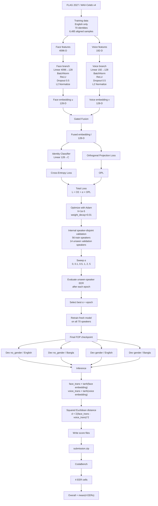
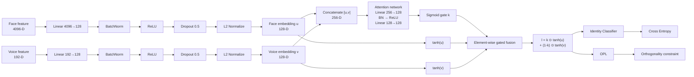
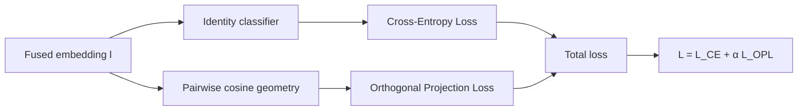
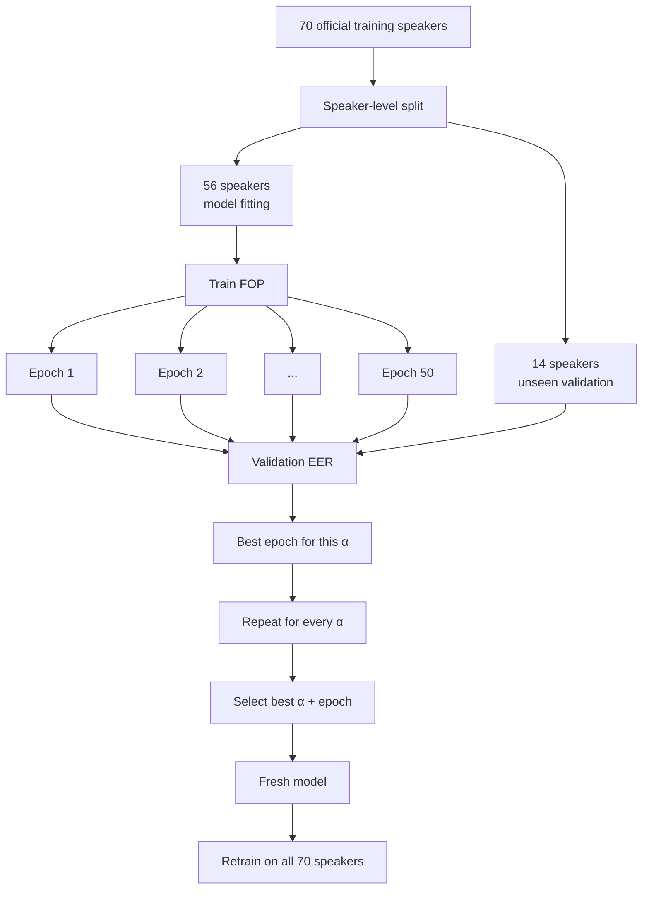
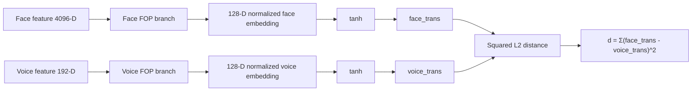
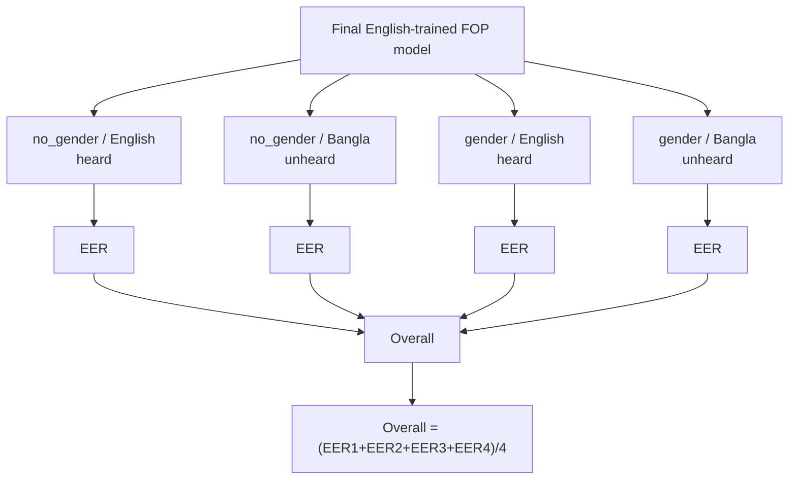
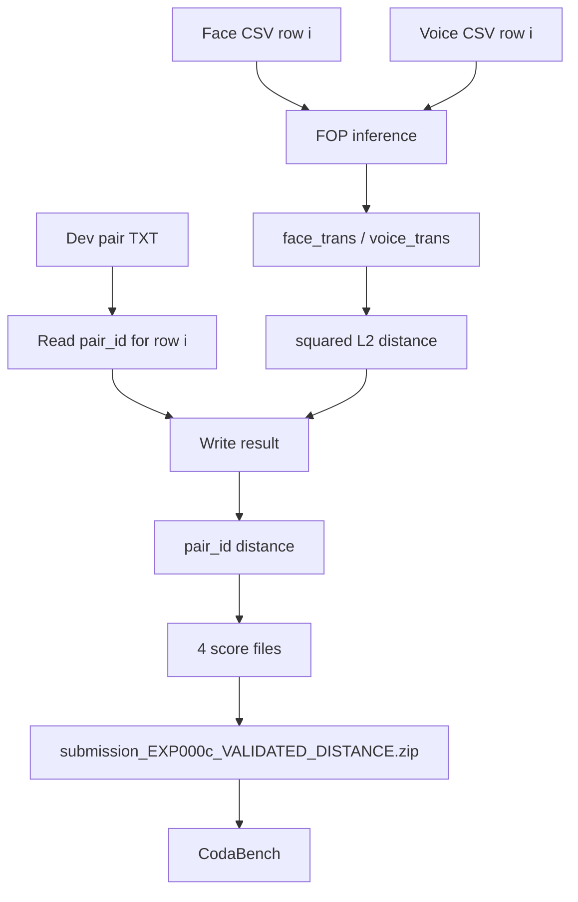
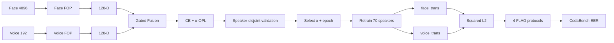

# FLAG 2027 — EXP-000c Pipeline

> Canonical baseline: **EXP-000c — Source-Faithful FOP**
>
> Current validated CodaBench baseline: **Overall EER = 42.17%**
>
> Important scoring note: current live CodaBench behaves as **distance-oriented**:
>
> `submission_score = squared_L2_distance`  
> **Lower score = more likely same speaker**

---

## 1. End-to-end pipeline



---

## 2. FOP model detail



---

## 3. Gated fusion formula

Given:

- `u` = face embedding, shape `128`
- `v` = voice embedding, shape `128`

Concatenate:

```text
[u, v] ∈ R^256
```

Attention:

```text
k = sigmoid(F_att([u, v]))
```

where:

```text
F_att:
Linear(256 → 128)
→ BatchNorm1d
→ ReLU
→ Linear(128 → 128)
```

Transform each modality:

```text
u_t = tanh(u)
v_t = tanh(v)
```

Fuse:

```text
l = k ⊙ u_t + (1 - k) ⊙ v_t
```

where `⊙` is element-wise multiplication.

Interpretation:

```text
k_j ≈ 1  → dimension j relies more on face
k_j ≈ 0  → dimension j relies more on voice
```

---

## 4. Training objective



### Cross-Entropy

Purpose:

> Make the fused embedding discriminative for speaker identity.

```text
L_CE = classification loss over training identities
```

### Orthogonal Projection Loss

For same-identity embeddings:

```text
cosine → 1
```

For different-identity embeddings:

```text
|cosine| → 0
```

Formula used by the FOP implementation:

```text
L_OPL =
(1 - mean_positive_cosine)
+ 0.7 × mean_absolute_negative_cosine
```

Total:

```text
L_total = L_CE + α × L_OPL
```

Alpha candidates:

```text
α ∈ {0.0, 0.1, 0.5, 1.0, 2.0, 5.0}
```

---

## 5. Speaker-disjoint model selection

FLAG evaluates **unseen identities**, so random row splitting is not appropriate.



Important:

```text
train loss ≠ model-selection metric
```

The primary internal selection signal is:

```text
unseen-speaker verification EER
```

---

## 6. Internal validation pair construction

For each held-out sample:

### Positive pair

```text
face_i + voice_i
label = same speaker
```

### Negative pair

```text
face_i + voice_j
speaker(i) != speaker(j)
label = different speaker
```

The validation set is balanced:

```text
50% positive
50% negative
```

---

## 7. Inference pipeline



The classifier is **not used** at test time.

The final task is not:

```text
predict one of the 70 training identities
```

It is:

```text
does this face match this voice?
```

---

## 8. Local score vs CodaBench score

This distinction is critical.

### Local ROC / AUC / EER

`sklearn` convention:

```text
higher score = positive / same speaker
```

So locally:

```text
similarity = - squared_L2_distance
```

### Current live CodaBench

Empirically validated:

```text
submission_score = + squared_L2_distance
```

and:

```text
LOWER score = more likely same speaker
```

Same checkpoint:

| Submitted value | Overall EER |
|---|---:|
| `- squared_L2` | 57.83% |
| `+ squared_L2` | **42.17%** |

Therefore:

```text
LOCAL:
-d²

CODABENCH:
+d²
```

Do **not** confuse these two.

---

## 9. Four official evaluation cells



Definitions:

### no_gender

Standard protocol.

Negative speaker may belong to a different gender.

### gender

Gender-constrained protocol.

Negative speaker is restricted to the same gender as the positive speaker.

Purpose:

> Reduce the usefulness of gender as an identity shortcut.

### English / heard

English is available during training.

### Bangla / unheard

Bangla is not used to train the baseline.

This evaluates language generalization.

---

## 10. Submission pipeline



Expected archive:

```text
submission.zip
├── no_gender/
│   ├── sub_score_v4_English_heard.txt
│   └── sub_score_v4_Bangla_unheard.txt
└── gender/
    ├── sub_score_v4_English_heard.txt
    └── sub_score_v4_Bangla_unheard.txt
```

Each line:

```text
<pair_id> <raw_positive_squared_L2_distance>
```

No header.

---

## 11. Current validated baseline

| Protocol | EXP-000c EER | Organizer FOP reference |
|---|---:|---:|
| no_gender / English | **36.31** | 32.54 |
| no_gender / Bangla | **38.98** | 38.12 |
| gender / English | **43.38** | 32.99 |
| gender / Bangla | **50.00** | 44.01 |
| **Overall** | **42.17** | **36.92** |

Current gap:

```text
42.17 - 36.92 = 5.25 EER points
```

Main observed weakness:

```text
gender-constrained protocols
```

especially:

```text
gender / Bangla = 50.00 EER
```

This does not yet prove that gender shortcutting is the only cause.

---

## 12. Compact pipeline



---

## 13. One-line summary

```text
English face/voice features
→ modality projections
→ gated multimodal FOP training with CE + OPL
→ speaker-disjoint alpha/epoch selection
→ retrain on all 70 identities
→ compare face_trans and voice_trans using squared L2
→ submit raw distance to 4 FLAG protocol cells
→ minimize mean EER
```
