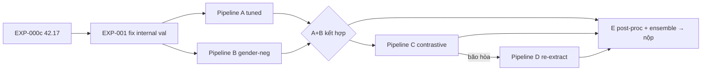

# Kế hoạch nghiên cứu FLAG 2027 — FourFusion

Ngày lập: 2026-09-21, cập nhật 2026-09-22. Baseline: **EXP-003c InfoNCE-ens + CCA-k4 + centering (không AS-norm) = 31.34** (25.60 / 27.88 / 34.01 / 37.87) (FOP 000c: 42.17; organizer ref 36.92). Mục tiêu giai đoạn: **≤ 31** rồi **≤ 28**. Quy tắc nộp: submission cuối = ghép per-cell tốt nhất; mỗi EXP chỉ cần thắng ở ít nhất một cell.

---

## 1. Chẩn đoán từ baseline

| Quan sát | Hệ quả |
|---|---|
| `no_gender/English` 36.31 vs ref 32.54 (−3.8) | Cùng kiến trúc FOP nhưng kém hơn → **gap do implement / hyperparameter**, không phải do phương pháp. |
| `gender/Bangla` = **50.00** (random) | Khi bỏ shortcut giới tính và đổi ngôn ngữ, model không còn tín hiệu gì. Embedding hiện tại chủ yếu học **giới tính**, chưa học identity. |
| `gender/English` 43.38 vs `no_gender/English` 36.31 (+7) | Xác nhận: phần lớn "khả năng phân biệt" đến từ giới tính. |
| Internal val chỉ có negative ngẫu nhiên (khác speaker, không ép giới tính) | **Internal val đang đo sai thứ**: nó thưởng cho model học giới tính. Đây là lỗi model-selection cần sửa **trước** mọi thí nghiệm khác. |
| lr = 1e-5, 50 epoch, Adam, dropout 0.5, batch 128 | lr rất nhỏ so với dataset 6.5k mẫu; có thể chưa hội tụ. |

**Giả thuyết chính (H1):** Model đang học gender shortcut vì (a) internal validation không phạt điều đó và (b) CE trên 56 lớp + OPL không đủ ép cross-modal alignment. Sửa validation + tăng cường negative cùng giới sẽ cải thiện mạnh 2 cell `gender/*`.

**Giả thuyết phụ (H2):** Gap 3.8 điểm ở `no_gender/English` đóng được bằng tune hyperparameter (lr, epoch, dropout, embed dim) và seed-ensemble.

### 1b. Bằng chứng từ EDA-000 (2026-09-21) — chi tiết tại [../Experiment/EDA-000_raw/NOTES.md](../Experiment/EDA-000_raw/NOTES.md)

| Bằng chứng | Hệ quả cho kế hoạch |
|---|---|
| **CCA tuyến tính** (không train deep), speaker-disjoint 3 seed: k=32 → internal **29 / 35** (no_gender / gender). FOP 000c trên CB: 36.3 / 43.4. | Feature gốc đủ tốt; **bottleneck là training/generalization của FOP** → A/C ưu tiên cao nhất, D xuống cuối. Nộp `submission_cca_k32.zip` 1 lần để calibrate internal↔CB. |
| CCA EER tăng đơn điệu theo k: 4 → 24/35.5, 32 → 30/35, 64 → 37/40, 128 → 45/46 (train vẫn 7.5). | Với 56 speaker, chiều shared dùng được ≈ 8–32. **embed_dim=128 + CE 56 lớp là công thức overfit.** A phải sweep embed 32/64, wd lớn, early-stop theo `int_g`. |
| Cell gender phẳng ≈ 35 với mọi k; gender probe face 93% / voice 92%; project-out gender tuyến tính không giúp. | Identity thật (ngoài gender) có trần tuyến tính ≈ 35. Gender **không** là 1 hướng tuyến tính → F-linear vô ích; B hợp lý hơn. Chọn model theo `int_g`. |
| Voice train chỉ **4029 unique / 6485 hàng** (nhiều face crop / 1 audio); id006, id052 có 2 mẫu. | Sampler 1 mẫu/voice-clip/batch hoặc weight 1/dup; loại id006/id052 khỏi val. |
| Dev lệch train chủ yếu là **mean-offset** (voice centroid 2.1–2.4 sd, face 1.0 sd) nhưng kNN/MMD ≈ held-out speakers. | E (per-file centering / z-norm / AS-norm) có cơ sở, rất rẻ → **đưa vào ngay EXP-002**, không để cuối. |
| Dev English & Bangla **cùng người** (96% face Bn có face En cos > 0.6); language shift chỉ ở voice (probe 88%, centroid 2.6 sd). | Cell Bangla: per-language voice centering trước; multilingual voice (D) sau. |

**Thứ tự bottleneck sau EDA:** (1) capacity/overfit + model selection → (2) score normalization E → (3) gender-aware negatives B → (4) voice language shift D. Fusion architecture không phải ưu tiên.

---

## 2. Bộ khung đánh giá (làm TRƯỚC, dùng cho mọi pipeline)

**EXP-001 — Fix internal validation protocol** *(không thay đổi model)*

- Speaker-disjoint split 56/14 giữ nguyên, nhưng dùng **nhiều seed split** (ví dụ 3 fold) để giảm phương sai vì 14 speaker là rất ít.
- Xây **2 bộ trial** trên val speaker, mô phỏng đúng 4 cell:
  - `internal/no_gender`: negative = voice của speaker khác bất kỳ.
  - `internal/gender`: negative = voice của speaker khác **cùng giới tính** (dùng `meta_file_train_set.csv`).
- Metric chọn model = **mean(EER_no_gender, EER_gender)** trên internal.
- Kỳ vọng: checkpoint EXP-000c sẽ cho internal/gender ≈ 45–50 → xác nhận H1.
- Deliverable: một hàm `evaluate_internal(model) -> dict` dùng lại được cho mọi thí nghiệm sau.

Không có bước này thì mọi so sánh pipeline sau đều không tin được.

---

## 3. Các pipeline ứng viên

| ID | Pipeline | Thay đổi so với baseline | Nhắm vào | Chi phí | Ưu tiên |
|---|---|---|---|---|---|
| **A** | FOP tuned | lr 1e-4…1e-3, epoch ≤ 100, dropout 0.2/0.5, embed 128/256, cosine schedule, seed ensemble ×3 | H2, đóng gap no_gender | Thấp (features có sẵn) | ★★★ 1 |
| **B** | FOP + gender-aware negatives | OPL/contrastive chỉ tính negative **cùng giới**; hoặc batch sampler ép mỗi batch cùng giới | H1, cell gender/* | Thấp | ★★★ 1 |
| **C** | Cross-modal contrastive (CLIP-style) | Bỏ CE-classifier, dùng symmetric InfoNCE face↔voice (temperature τ), có thể + SupCon theo speaker | Học alignment trực tiếp thay vì qua classifier 56 lớp | Thấp–TB | ★★☆ 2 |
| **D** | Re-extract features | Trích lại từ jpg/wav thô: voice WavLM / ECAPA-large / ReDimNet, face ArcFace / AdaFace; rồi chạy A/B/C trên feature mới | Trần chất lượng feature, đặc biệt Bangla (unheard) | Cao (GPU, 2.4 GB thô) | ★☆☆ 3 |
| **E** | Score post-processing | Per-protocol z-norm / AS-norm dùng cohort từ chính dev feature (unsupervised), ensemble nhiều checkpoint | Rẻ, cộng thêm 0.5–2 điểm trên mọi pipeline | Rất thấp | ★★☆ luôn chạy sau cùng |
| **F** | Gender-adversarial / disentangle | Gender classifier + gradient reversal trên fused embedding, hoặc project-out gender direction | H1 mạnh tay hơn B | TB | ★☆☆ nếu B chưa đủ |

### Mô tả ngắn từng pipeline

**A — FOP tuned.** Giữ đúng kiến trúc EXP-000c. Sweep: `lr ∈ {1e-5, 1e-4, 5e-4, 1e-3}`, `dropout ∈ {0.2, 0.5}`, `embed ∈ {32, 64, 128}` (EDA-3: k>32 overfit), `wd ∈ {1e-2, 1e-1}`, `α ∈ {0.5, 1, 2}`; input = standardize + PCA-256 face (EDA-2). Chọn theo `int_g`/`int_mean` ở §2. Sau đó train 3 seed, average score. Biến thể A': khởi tạo projection từ CCA.

**B — Gender-aware negatives.** Hai biến thể độc lập:
- B1: OPL chỉ lấy `mask_neg` với cặp cùng giới (`gender[i] == gender[j]`), cặp khác giới bỏ hoặc weight thấp.
- B2: Batch sampler "gender-homogeneous": mỗi batch toàn nam hoặc toàn nữ → mọi negative trong batch đều là hard-negative theo giới.

**C — Contrastive.** Với batch B cặp (face_i, voice_i): logits = `u·vᵀ / τ`, loss = `(CE(row) + CE(col))/2`; nếu 2 mẫu cùng speaker thì coi là positive (SupCon). Dùng cosine tại inference (nộp distance = `2 − 2·cos` để giữ lower = same). Có thể kết hợp gender-homogeneous batch của B2.

**D — Re-extract.** Chỉ làm khi A+B+C đã bão hòa. Cần xác định trước feature gốc của organizer là gì (so norm/phân phối) để chọn backbone khác họ, tránh lặp.

**E — Post-processing.** Chạy trên mọi submission: (0) **per-file mean-centering feature** trước khi chiếu (EDA-6: dev lệch train 1–2.4 sd chỉ ở centroid), (1) z-score theo từng file, (2) AS-norm với cohort = toàn bộ face/voice trong cùng protocol file, (3) average score nhiều seed/checkpoint. Kiểm tra bằng internal val (mô phỏng: center theo val-set) trước khi nộp.

---

## 4. Lộ trình & tiêu chí quyết định

| Mốc | Điều kiện chuyển tiếp |
|---|---|
| Sau EXP-001 | Có bảng internal (no_gender, gender) cho checkpoint 000c; đã có hàm `evaluate_internal`. |
| Sau A | internal mean EER giảm ≥ 2 điểm so với 000c *trên cùng split* → nộp CodaBench 1 lần để calibrate internal ↔ CodaBench. |
| Sau B | internal/gender giảm rõ (≥ 5 điểm). Nếu không → chuyển sang F. |
| Chọn pipeline chính | Lấy pipeline có **internal mean EER thấp nhất** trên ≥ 2 split seed; **không** chọn theo CodaBench. Chỉ nộp CodaBench để xác nhận, tối đa 1 lần / pipeline. |
| Kích hoạt D | Khi A/B/C không cải thiện thêm > 1 điểm sau 2 vòng, hoặc khi cell Bangla vẫn ≥ 40 trong khi English < 32. |

Ngân sách CodaBench: giả định giới hạn submit → mỗi pipeline tối đa 1 lần nộp + 1 lần cho ensemble cuối.

---

## 5. Danh sách thí nghiệm dự kiến

| EXP | Parent | Nội dung | Trạng thái |
|---|---|---|---|
| 000c | – | FOP source-faithful baseline | ✅ 42.17 |
| EDA-000 | – | Raw/speaker/geometry/CCA/gender/language/shift EDA-0→6 | ✅ xem NOTES |
| 000d | EDA-000 | CCA linear k=32 (không train deep) — calibrate internal↔CB | ✅ **35.79** (33.7/34.0/34.4/41.0) |
| 000e | 000d | CCA linear k=4 (gender-heavy) | ✅ **34.46** (29.0/29.0/37.5/42.4) |
| 000f | 000d/e | Hybrid per-protocol: k=4 cho `no_gender/*`, k=32 cho `gender/*` | ✅ 33.35 |
| 002 | 000f | E: per-file centering + AS-norm trên CCA | ✅ internal −2 (gộp vào 003b) |
| 003 | 000f | Deep sweep A/AB/B/C, emb 32–128, chọn theo int_g | ✅ InfoNCE > CCA > CE+OPL |
| 003b | 003 | C ×3 seed + CCA-k4 + E (centering + AS-norm), z-fusion | ✅ 31.96 |
| 003c | 003b | Như 003b, **bỏ AS-norm** | ✅ **31.34** — baseline hiện hành |
| 004 | 003c | Bangla: full CORAL dev→train | ❌ **41.36** — whitening xoá identity |
| 005 | 003c | Partial CORAL (α sweep) + language-direction projection + tune C + ensemble 10 seed | ☐ |
| 001 | 000c | Internal val có gender-constrained + multi-split (dùng `eda_utils.build_trials`); đánh giá lại checkpoint 000c; **EDA-7 FOP anatomy** | ☐ |
| 002 | 001 | A: sweep lr / dropout / embed / α theo metric mới | ☐ |
| 003 | 002 | B1: OPL negative cùng giới | ☐ |
| 004 | 002 | B2: gender-homogeneous batch sampler | ☐ |
| 005 | 003/004 | Kết hợp A + B tốt nhất, 3 seed ensemble, nộp CodaBench | ☐ |
| 006 | 002 | C: InfoNCE / SupCon cross-modal | ☐ |
| 007 | 005/006 | E: z-norm / AS-norm / ensemble trên pipeline tốt nhất | ☐ |
| 008 | – | D: khảo sát feature gốc + re-extract voice (WavLM/ECAPA) | ☐ tùy điều kiện |
| 009 | – | F: gender-adversarial | ☐ tùy điều kiện |

Cập nhật trạng thái tại [../Experiment/EXPERIMENT_LOG.md](../Experiment/EXPERIMENT_LOG.md).

---

## 6. Tài liệu tham chiếu

- Saeed et al., *Fusion and Orthogonal Projection for Improved Face-Voice Association*, ICASSP 2022 — https://github.com/msaadsaeed/FOP
- Organizer repo: https://github.com/SwapnilKhandoker101/FLAG_2027
- Challenge page: https://mavceleb.github.io/dataset/competition.html
- Pipeline baseline chi tiết: [../Experiment/EXP-000c_fop_baseline/PIPELINE.md](../Experiment/EXP-000c_fop_baseline/PIPELINE.md)
