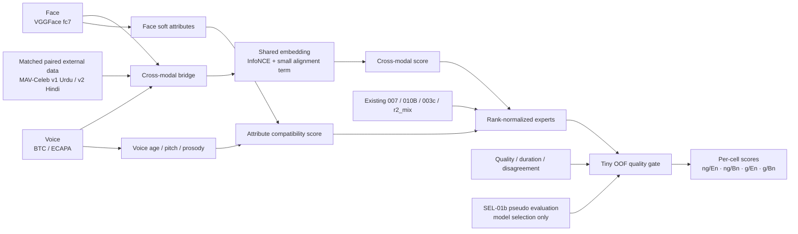
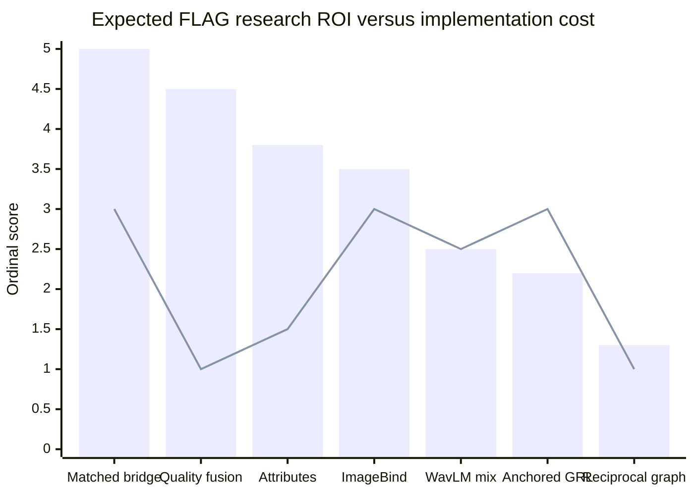
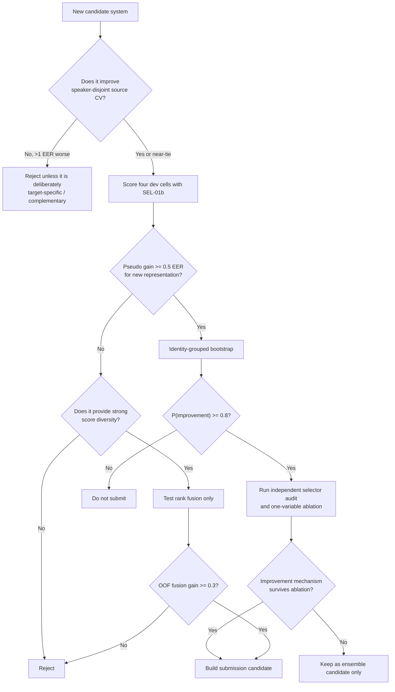
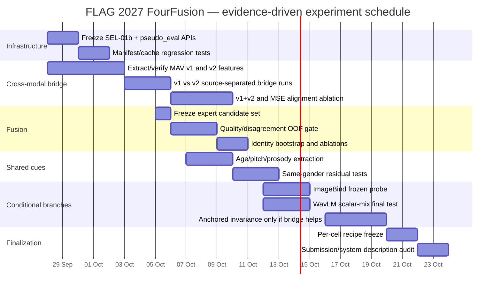

# FLAG 2027 Deep Research Report: Methods That Best Fit the Problem Logic

## Executive Summary

FLAG 2027 is not a conventional face–voice matching problem. It combines three constraints that fundamentally change which methods are likely to work: the training set is very small and **English-only**; Bengali is an **unlabeled target language**; and half of the evaluation removes the easiest demographic cue by forcing impostors to have the **same gender**. The official challenge explicitly frames this as a test of whether models learn speaker-specific cross-modal traits rather than language and gender shortcuts. citeturn7academia15turn7search1

The FourFusion experiments now provide unusually strong evidence about where the bottleneck actually lies. The current FUSE-03 system is **28.69 EER overall** with `23.61 / 26.88 / 29.12 / 35.15` on `ng/En / ng/Bn / g/En / g/Bn`. More importantly, SEL-01b has become a highly effective local target-domain selector: ArcFace-based face clustering reaches ARI ≈0.991, pseudo-label coverage is 96–99%, and the pseudo-EER ranking correlates with CodaBench at roughly **0.95–0.996 Spearman depending on cell**. fileciteturn0file0 fileciteturn0file1

The strongest research conclusion is therefore **not** “we need a stronger face encoder” or “we need a stronger speaker encoder.” ArcFace dramatically improves unimodal face recognition yet damages face↔voice verification; ReDimNet2 improves voice↔voice EER from roughly 4.8% to 3.2% while leaving cross-modal quality flat or worse. WavLM/XLS-R replacements have also not improved the bridge. The limiting factor is now the **cross-modal bridge: which components of a face embedding are predictable from a voice, and vice versa, under a language shift and same-gender restriction**. fileciteturn0file1 This is consistent with the face–voice literature: successful systems explicitly learn a shared representation or exploit shared soft-biometric information rather than simply maximizing unimodal identity discrimination. citeturn8academia1turn8academia2turn12academia26

The resulting priority order is:

**First:** train a better cross-modal bridge using **source-matched paired external data**, with v1 Urdu and v2 Hindi evaluated separately before combining them, while keeping the already reproduced VGGFace/ECAPA representation fixed. Use symmetric contrastive alignment plus a small explicit MSE/shared-center term. This directly addresses the proven bottleneck, whereas the European English/German v3 external set already produced negative transfer. fileciteturn0file1 XM-ALIGN and the FAME 2026 winner provide strong methodological precedent for explicit + implicit shared-space alignment. citeturn8academia1turn8academia2

**Second:** exploit the already demonstrated complementarity between systems with a **strictly constrained quality-aware rank gate**, trained out-of-fold by pseudo identity. FUSE-01→03 shows that fusion has generated more reliable progress than replacing encoders. The ICCV 2025 QME work provides external support for conditioning fusion weights on sample quality, but FourFusion should use a far smaller gate because the target set is tiny. citeturn10search3 fileciteturn0file1

**Third:** attack `gender/English` with an **attribute-complementary residual score**, beginning with age and voice prosody/pitch rather than gender. Face–voice literature repeatedly finds shared information related to demographics and physical traits; FAME 2026's winning system also explicitly added age-gender features. citeturn12academia26turn11search1turn8academia1 Explicit gender should not be revisited because FourFusion already showed that the current embeddings encode gender strongly and a separate gender score does not produce stable gains. fileciteturn0file1

By contrast, **DEV/IWCV/SND are now validation audits rather than primary selectors**, because SEL-01b empirically dominates the problem they were meant to solve. **Blind GRL/DANN should stay closed**; Dual-LoRA is interesting only after multilingual external training data are available, because its central contribution is an anchored language adversary that avoids deleting speaker information. citeturn8academia0turn10search8 **WavLM scalar mixing deserves one controlled final test**, because the existing WavLM experiment did not use the all-layer weighted pooling shown to work in speaker verification, but it is not a top-three priority. citeturn13search0 Graph propagation is also low priority because GRAPH-01 has already produced negative results, despite the general success of k-reciprocal re-ranking in retrieval. citeturn13search1 fileciteturn0file1

The architecture implied by the evidence is therefore:



The critical discipline is that **SEL-01b remains an evaluator/model-selector, not a direct identity scoring mechanism**. The logs show that trial structure can almost reconstruct the dev labels; exploiting that directly would measure protocol structure rather than transferable face–voice association. fileciteturn0file1


## Problem Geometry and What the Existing Experiments Have Established

The official FLAG formulation evaluates unseen identities under a heard language and an unheard language, with both an unconstrained gallery and a same-gender gallery. The challenge specifically states that performance deterioration under language shift and gender constraint is the phenomenon it is designed to study. citeturn7academia15turn7search2 The FourFusion development data instantiate this as four cells:

| Cell | Language | Negative constraint | Dev trials | Primary difficulty |
|---|---|---|---:|---|
| `ng/En` | English, heard | unrestricted | 1,008 | ordinary face↔voice association; demographic shortcuts available |
| `ng/Bn` | Bengali, unheard | unrestricted | 1,406 | cross-language shift |
| `g/En` | English, heard | same gender | 982 | cross-modal identity/shared-attribute signal beyond gender |
| `g/Bn` | Bengali, unheard | same gender | 1,468 | both difficulties simultaneously |

The training set contains **70 identities and 6,485 English face–voice rows, with no Bengali training utterances**. Raw audio/images and the organizer's 4,096-d face / 192-d voice representations are provided. fileciteturn0file8 The challenge page independently confirms the 70-identity English training structure and that evaluation labels are not supplied. citeturn7search1

That gives a learning problem closer to

\[
\underbrace{p_{\text{train}}(f,v,y\mid L=\mathrm{En})}_{70\text{ identities, labeled}}
\quad\rightarrow\quad
\underbrace{p_{\text{dev}}(f,v\mid L\in\{\mathrm{En},\mathrm{Bn}\})}_{unlabeled}
\]

than to ordinary supervised verification. Moreover,

\[
p(v\mid \text{speaker},L=\mathrm{En})
\ne
p(v\mid \text{speaker},L=\mathrm{Bn}),
\]

while the face modality is effectively language-independent. Internal EDA found that same-speaker English↔Bengali voice similarity drops substantially relative to within-language speech, while remaining far above different-speaker similarity. fileciteturn0file7 This makes the task a **cross-modal mapping problem under one-sided domain shift**, not merely speaker verification under another language.

The current results sharpen the diagnosis further:

| Evidence | What it rules in/out |
|---|---|
| ArcFace face↔face EER ≈1.7%, but cross-modal proxy ≈33.9 vs VGG ≈26.2 | Better face identity recognition is **not** the missing capability |
| ReDimNet2 improves voice↔voice EER to ≈3.17%, but cross-modal stays ≈26.8–27.0 and dev becomes worse | Better speaker verification is **not** sufficient |
| ECAPA 6144-d helps English but hurts cross-language transfer | More information can mean more nuisance information |
| WavLM L4–9 and XLS-R did not beat the present speaker feature | Generic multilingual SSL is not automatically language-invariant for this task |
| FUSE-01/02/03 consistently improve by combining complementary systems | Error diversity is real and exploitable |
| SEL-01b predicts system rankings extremely well | Target-domain model selection is largely solved locally |
| GRAPH-01 hurts English | Unimodal topology does not automatically induce the correct cross-modal topology |
| External v3 English/German hurts all four cells | External paired data are useful only if their transfer structure is appropriate |
| `r2_mix` is worse for very short Bengali but much better on longer Bengali | “Crop helps because Bengali is short” is false or at least incomplete |

All of these findings are documented in the latest experiment log. fileciteturn0file1

This makes the key research gap:

\[
\boxed{
\text{good face identity representation}
+
\text{good voice identity representation}
\not\Rightarrow
\text{good face–voice association}
}
\]

The model must preserve the subset of information that is **both identity-correlated and cross-modally observable**. This fits classic observations that face–voice association contains shared information related to attributes such as age and gender, yet does not reduce to those attributes. citeturn12academia26turn11search2 Speech2Face independently shows that speech contains enough information to predict visible age/gender/other physical regularities without explicit attribute supervision. citeturn11search1

The language constraint adds a second requirement:

\[
z_v =
z_{\text{speaker-shared}}
+
z_{\text{language}}
+
z_{\text{channel}}
+
z_{\text{utterance}},
\]

but only the first component, plus stable physical/paralinguistic correlates, is desirable for the bridge. A richer speaker feature can improve English discrimination while increasing sensitivity to the other components—exactly what the 6,144-d experiment shows. fileciteturn0file1

The same-gender setting gives a useful interpretation of the four cells. `ng/*` rewards any legitimate shared cue, including gender. `g/*` deliberately removes gender as an impostor discriminator. Therefore a representation that simply **erases gender everywhere** is not theoretically necessary, and FourFusion empirically found it harmful. The challenge asks for identity-specific information *beyond* gender, not necessarily gender-free embeddings. citeturn7academia15 fileciteturn0file3

Finally, duration should no longer be treated as a primary causal explanation for Bengali degradation. Bengali is indeed shorter on average in this dataset, but FUSE-03's detailed duration analysis shows the supposedly “short-robust” system is actually worse in the 0–3 s bin and much better on long Bengali samples. fileciteturn0file1 The gate is useful empirically; its interpretation remains unresolved.


## Research Evidence and Candidate Method Families

The most relevant literature points in a surprisingly consistent direction. FOP learns a discriminative joint representation using fusion and orthogonality. citeturn11academia39 PAEFF argues that face and voice embeddings should be **aligned before fusion** because their spaces have different characteristics. citeturn11academia37 XM-ALIGN combines a shared classifier with explicit MSE face↔voice alignment. citeturn8academia2 The FAME 2026 winning system learns a shared multimodal embedding and supplements it with age/gender information. citeturn8academia1 ImageBind-LoRA obtains strong cross-language FAME performance by starting from an already shared audio-image foundation space. citeturn9academia43

The methodological conclusion is that the next gains should come from **better transfer of shared information**, not greater single-modality separability.

| Family | Cross-lingual robustness | Same-gender resilience | Data requirement | T4×2 cost | FLAG-specific risk | Priority |
|---|---|---|---|---|---|---|
| SEL-01b + DEV/IWCV/SND audit | High value for *selection*, not scoring | Neutral | source labels + unlabeled dev | Very low | SEL-01b can leak trial structure if misused | Infrastructure |
| Matched paired external bridge pretraining | **High** | **High** | paired external + FLAG | Medium | source/population mismatch; identity overlap | **Very high** |
| Contrastive + MSE/shared-center alignment | **Medium–high** | **High** | paired train; stronger with external | Low–medium | overfit with only 70 speakers | **Very high** |
| Quality-aware rank fusion | Medium indirectly | Medium–high | existing scores + quality | **Very low** | target overfitting | **Very high** |
| Age/pitch/prosody residual scoring | Low–medium | **High** | pretrained attribute models; no paired external required | Low | noisy age/prosody estimates | High |
| Frozen ImageBind probe / tiny adapter | Potentially **high** | Medium | raw image/audio | Medium | domain mismatch; rules/system-description clarity | Medium–high |
| WavLM all-layer scalar mix | Medium | Low–medium | raw audio | Medium once, then low | current WavLM already negative | Medium–low |
| Anchored adversarial invariance | Potentially high | Neutral | multilingual language-labeled source | Medium | can delete identity information | Medium–low now |
| Duration gate | Empirically useful | Empirically useful on g/Bn | duration + scores | Negligible | causal story currently unsupported | Maintain, do not expand yet |
| Reciprocal re-ranking | Unclear | Unclear | target embeddings/scores | Low | GRAPH-01 already negative | Low |
| Generic stronger face/voice encoder | Low expected ROI | Low | raw media | Medium | empirically saturated | **Closed/very low** |

**Unsupervised model selection.** DEV estimates target risk using labeled source data, unlabeled target data and adapted features, while IWCV reweights validation risk under the stricter assumption of covariate shift. citeturn10search2turn10search0 SND instead evaluates how densely target samples form neighborhoods in representation space. citeturn10search1 These remain valuable as **independent audits** of SEL-01b, but there is no reason to replace SEL-01b now: FourFusion has already retrospectively validated SEL-01b across many submitted systems, obtaining near-perfect within-cell ranking on materially different models. fileciteturn0file1

IWCV in particular should not be trusted as the sole FLAG selector, because its clean guarantee assumes \(p(y\mid x)\) does not change between source and target. citeturn10search0 FLAG may involve conditional shift: the relationship between voice characteristics and identity-relevant shared cues can itself change with language. More generally, theory warns that marginal domain invariance alone is insufficient when conditional distributions change. citeturn10search8 This is consistent with FourFusion's CORAL failure: removing domain statistics successfully reduced language differences but destroyed identity information. fileciteturn0file1

**Attribute-complementary scoring.** The correct hypothesis is not “predict gender better.” It is “find cross-modally observable traits that remain informative after gender is fixed.” Classic face–voice work found latent associations with demographic and modality-specific attributes, while Speech2Face learned physical correlations such as age and gender from speech alone. citeturn12academia26turn11search1 FAME 2026's winning system explicitly supplements the core face/voice features with age-gender features. citeturn8academia1 The ACM MM 2024 FAME system also used age/gender matching confidence during score polarization. citeturn12academia27 For FLAG, the safest implementation is **score-level residual information**—e.g. age compatibility, F0/pitch distribution, speaking-rate/prosody statistics—not a large concatenated network.

**Shared embedding alignment.** This is the family with the strongest direct fit. Symmetric InfoNCE already works well internally. XM-ALIGN adds explicit MSE alignment and a shared classifier; the FAME winner uses a shared embedding with AAM; PAEFF explicitly aligns spaces before fusion. citeturn8academia2turn8academia1turn11academia37 With FourFusion's 70-speaker train, the correct experiment is not a new large encoder but a small projection:

\[
L=
L_{\mathrm{InfoNCE}}
+\lambda_{\mathrm{align}}
\lVert z_f-z_v\rVert_2^2
+\lambda_{\mathrm{cls}}L_{\mathrm{shared\ center}}.
\]

Only one extra term should be introduced at a time. Given the existing negative result for AAM-only/FAME-style recipes, the shared classifier is an ablation rather than the main proposal. fileciteturn0file1

**ImageBind probing.** ImageBind learns a common space for image and audio among six modalities. citeturn11search0 A FAME 2026 system then adapted ImageBind with LoRA using an external Arabic VoxBlink subset and obtained 24.73% EER on English/German evaluation. citeturn9academia43 For FLAG, this justifies a very cheap **frozen-probe-first** protocol: evaluate frozen audio↔image similarity and a small FLAG-only linear projection before any LoRA. If the frozen representation provides no speaker-discriminative signal under SEL-01b, there is little justification for an expensive adapter run.

**Adversarial or anchored language invariance.** FourFusion's blind DANN/GRL result is negative, and that result has a good theoretical explanation. Invariance can suppress informative structure when nuisance and class information are statistically entangled. citeturn10search8 Dual-LoRA is more sophisticated: it reports that blind adversarial disentanglement can penalize speaker-discriminative traits correlated with language, and replaces it with task-factorized LoRA plus a **language-anchored adversary**. citeturn8academia0 That is relevant only once v1/v2 or another legitimate multilingual paired source supplies language variation during training; English-only FLAG train cannot identify which feature directions are truly linguistic.

**SSL pooling.** The existing “WavLM failed” result should be interpreted narrowly. Microsoft's speaker-verification study uses a **learnable weighted average of all pretrained hidden layers** before an ECAPA downstream network, and reports the weighted representation outperforming conventional filterbanks. citeturn13search0turn13academia24 WavLM itself was designed for broad speech tasks and retains both content and speaker/paralinguistic information. citeturn13search2 Therefore one final scalar-mix experiment is justified:

\[
h=\sum_{\ell=0}^{L}\operatorname{softmax}(\alpha)_\ell
[\mu(h_\ell),\sigma(h_\ell)].
\]

But because ReDimNet and other stronger voice encoders failed to improve the bridge, the scalar mix should be treated as a **representation-diversity ablation**, not as the main solution. fileciteturn0file1

**Graph and reciprocal re-ranking.** k-reciprocal re-ranking is a valid unsupervised retrieval technique: it constructs mutual-neighbor features and combines Jaccard with original distance. citeturn13search1 However, FourFusion's GRAPH-01 already found that propagating through strong unimodal ArcFace/ECAPA neighborhoods worsened English fusion. fileciteturn0file1 That negative result is conceptually informative: a good within-face or within-voice manifold does not guarantee the graph edges preserve **cross-modal** similarity. A pure reciprocal/Jaccard experiment remains academically defensible, but it should not displace higher-priority work.

**Quality-aware dynamic rank fusion.** This is much better supported by internal results. Equal rank fusion repeatedly helped, and system complementarity is clear. QME at ICCV 2025 shows that learnable fusion conditioned on modality quality can outperform static averaging in multimodal biometric recognition. citeturn10search3 FourFusion should use only a tiny gate—linear or two-parameter sigmoid—because FUSE-03 has already shown that unconstrained target-fit weights can overfit while tiny OOF gates can transfer. fileciteturn0file1

**Paired external pretraining.** The official FLAG page permits pretrained face/voice encoders and requires all extra data and pretrained models to be declared; the current project has already begun declared external-data experiments. citeturn7search1 fileciteturn0file1 FAME 2026 provides strong precedent that additional paired audiovisual data can be decisive: the winning shared-space system and ImageBind-LoRA system both benefited from much more data than a 70-speaker training set. citeturn8academia1turn9academia43 But FourFusion's v3 result shows that **external data are not interchangeable**: English/German v3 degraded all four cells, so source/domain ablation is mandatory rather than simply pooling every available identity. fileciteturn0file1


## Candidate Engineering Matrix and Evaluation Protocol

The following table translates each research family into an executable FLAG experiment.

| Candidate | Required data | Kaggle T4×2 cost | Minimal implementation | Primary evaluation | Main failure mode | Required ablation |
|---|---|---|---|---|---|---|
| **SEL audit: DEV/IWCV/SND** | FLAG train labels + unlabeled dev | CPU / minutes | domain classifier + weighted EER; SND on shared embeddings | Spearman vs known CB across historical systems | proxy measures domain shape, not identity | each cell separately; leave-one-system-out retrospective test |
| **Pseudo-identity cycle** | ArcFace/ECAPA dev embeddings + trial list | CPU / minutes | fixed pseudo clusters; face→voice→face cycle consistency | SEL-01b pseudo-EER, coverage, CB retrospective ranking | protocol-structure leakage | selector only vs direct scoring prohibition |
| **Contrastive + MSE alignment** | paired FLAG train; preferably v1/v2 external | <1 GPU-h/run after features cached | two projections, InfoNCE, optional MSE | speaker-disjoint train CV + four pseudo-EER cells | collapse/overfit to 70 speakers | InfoNCE; +MSE; +shared center, one variable/run |
| **Matched external bridge pretraining** | MAV v1/v2 paired samples + FLAG | extraction ≈ hours once; bridge training cheap | source-aware loader; pretrain→FLAG fine-tune | SEL-01b all four cells + source holdout | negative transfer/source mismatch | v1 only; v2 only; v1+v2; never pool v3 by default |
| **Attribute residual** | pretrained age/voice attribute outputs | low | independent compatibility scores + rank fusion | especially `g/En`, then `g/Bn` | age/pitch estimator noise, demographic shortcut | same-gender impostors only; attribute shuffled control |
| **ImageBind frozen probe** | FLAG raw jpg/wav | moderate, one extraction pass | frozen image/audio embeddings, cosine, then linear projection | four pseudo-EER cells | semantic rather than speaker alignment | zero-shot → linear probe → only then LoRA |
| **Anchored invariance / Dual-LoRA style** | multilingual training source with language labels | medium | frozen backbone + factorized adapters + language anchor | En→Bn pseudo-EER, English regression guard | removes identity-correlated traits | ordinary GRL vs anchored; λ=0 control |
| **WavLM scalar mix** | raw audio | ~1 extraction pass | cache per-layer mean/std, learn 24/25 weights | pseudo-EER + complementarity with BTC ECAPA | useful speaker info still not face-predictable | current L4–9 vs mean-all vs learned mix |
| **k-reciprocal re-ranking** | complete dev embeddings/scores | CPU / minutes | reciprocal sets, Jaccard + original score | four pseudo-EER cells | local manifold not cross-modal | original score vs reciprocal only; λ sweep |
| **Quality-aware fusion** | existing model scores + quality descriptors | CPU / minutes | rank transform + tiny group-OOF gate | pseudo-EER OOF + bootstrap | target overfit | equal rank vs static weight vs quality gate |
| **Duration gate** | duration + scores | CPU / seconds | \(w=\sigma(a\log d+b)\) | identity-grouped OOF pseudo-EER | duration acts as proxy for another factor | constant weight vs duration shuffled |
| **External foundation/paired LoRA** | external declared paired data | medium-high | frozen backbone + LoRA | source holdout + FLAG pseudo-EER | domain/population mismatch | source-separated results mandatory |

Compute estimates are anchored to the current codebase, where full multi-feature extraction already runs comfortably on Kaggle T4 hardware, uses dynamic length batching, resumes per array, and separates extraction from cheap downstream sweeps. fileciteturn0file6

The validation protocol should now be standardized. Every candidate should report six things, not simply one pseudo-EER:

\[
\{\text{pseudo-EER}_{ng/En},
\text{pseudo-EER}_{ng/Bn},
\text{pseudo-EER}_{g/En},
\text{pseudo-EER}_{g/Bn},
\rho_{\text{historical}},
CI_{\Delta EER}\}.
\]

Here \(\rho_{\text{historical}}\) is retrospective Spearman against the systems for which real CodaBench EER is known, and \(CI_{\Delta EER}\) is a **paired bootstrap by pseudo identity**, not by individual trial. SEL-01b has already demonstrated that within-cell ranking, rather than cross-cell aggregate correlation, is the relevant criterion. fileciteturn0file1 This distinction is essential because EXP-012's score-distribution metrics appeared useful in aggregate yet had almost zero correlation within individual cells. fileciteturn0file1

The minimum decision rule should be:

\[
\text{accept candidate}
\iff
\begin{cases}
\Delta EER_{\text{OOF}}\le-0.30 & \text{for fusion/post-processing}\\
\Delta EER_{\text{pseudo}}\le-0.50 & \text{for a new representation}\\
P(\Delta EER<0)\ge0.8 & \text{bootstrap}\\
\text{no catastrophic regression in another required cell.}
\end{cases}
\]

These are proposed engineering gates, not literature constants.

For SEL-01b itself, the repository should distinguish **permitted evaluation use** from direct use in the scorer:

```python
ALLOW_PSEUDO_MODEL_SELECTION = True
ALLOW_PSEUDO_FUSION_FIT = True       # disclose as transductive
ALLOW_PSEUDO_TRAINING = False
ALLOW_PSEUDO_DIRECT_SCORING = False
```

That distinction is important because the internal log found that pseudo identities plus the trial graph can reconstruct an unusually large fraction of dev labels. fileciteturn0file1

### Expected return versus cost

The chart below is a **research-priority estimate**, not measured EER. ROI is an ordinal score incorporating fit to the proven bottleneck, internal evidence, and literature support; cost is approximate engineering/GPU burden on the current Kaggle pipeline.



Interpretation: the bars represent expected ROI; the line represents relative cost. The key outlier is **quality-aware fusion**, which has high expected value per unit of compute. Matched bridge training has the highest research upside but requires careful data preparation. Reciprocal graph methods are cheap but low priority because GRAPH-01 already supplied direct negative evidence. fileciteturn0file1


## Prioritized Experiments and Repository Changes

The top three experiments should be run in the following order. They address three distinct deficits, which reduces the chance that all three fail for the same reason.

**Priority A — BRIDGE-01: matched paired external pretraining with explicit alignment.**

This is the most important scientific experiment because it tests the strongest current hypothesis: **the bridge is data-limited and population/domain-sensitive**.

Use the exact reproduced BTC feature spaces rather than introducing another encoder variable. The latest project log has reconstructed the organizer-style VGGFace representation and BTC voice feature path, allowing v1/v2 features to be generated in the same space as v4. fileciteturn0file1

Run:

```text
A0: FLAG v4 only                    InfoNCE
A1: v1 Urdu → FLAG v4              InfoNCE
A2: v2 Hindi → FLAG v4             InfoNCE
A3: v1 + v2 → FLAG v4              InfoNCE
A4: best source → FLAG v4          InfoNCE + λ*MSE
A5: best source → FLAG v4          InfoNCE + λ*MSE + shared classifier
```

Do **not** combine v1/v2/v3 in the first run. External v3 has already demonstrated negative transfer, so “more identities” is not a valid independent variable. fileciteturn0file1

The core model should remain small:

\[
z_f = \operatorname{norm}(P_f x_f),\qquad
z_v = \operatorname{norm}(P_v x_v)
\]

with

\[
L =
L_{\mathrm{symInfoNCE}}
+\lambda_{\mathrm{MSE}}\|z_f-z_v\|^2.
\]

This follows the logic of XM-ALIGN while preserving FourFusion's already successful contrastive objective. citeturn8academia2 Shared AAM/class centers can then be added as the last ablation, informed by the FAME 2026 winner rather than replacing InfoNCE outright. citeturn8academia1

**Deliverables:**

```text
Experiment/EXP-BRIDGE-01/
├── config/
│   ├── v4_only.json
│   ├── v1.json
│   ├── v2.json
│   └── v1_v2.json
├── manifests/
│   ├── external_v1.json
│   └── external_v2.json
├── embeddings/
├── out/
│   ├── bridge_ablation.csv
│   ├── selector_metrics.json
│   ├── bootstrap.json
│   └── scores/
└── NOTES.md
```

A source manifest must include encoder revision, preprocessing, language/source, number of identities, utterance cap, and hashes. This prevents a repeat of earlier ambiguity over which ECAPA checkpoint generated a feature. fileciteturn0file1

**Priority B — FUSE-04: constrained quality-aware rank fusion.**

This is the most likely low-cost leaderboard gain. Start from the experts already proven complementary:

```text
English:
    007
    010B
    optionally BRIDGE-01 winner

Bangla:
    003c
    r2_mix
    optionally BRIDGE-01 winner
```

Transform every score to within-cell percentile rank first. Then fit only:

\[
w_i=\sigma(\beta_0+\beta^\top q_i)
\]

and

\[
s_i=w_i r_{A,i}+(1-w_i)r_{B,i}.
\]

The initial quality vector should be intentionally tiny:

\[
q_i=
[
\log d_i,\;
|r_{A,i}-r_{B,i}|,\;
\text{face-detection confidence},\;
\text{voice quality proxy}
].
\]

The strongest initial version can use only **duration + model disagreement**, avoiding another model dependency. QME supports the principle that quality-conditioned score fusion can exploit heterogeneous expert behavior. citeturn10search3 But unlike QME, FLAG's gate should contain only a handful of parameters and be trained with five-fold **GroupKFold by pseudo identity**.

Required ablation:

```text
B0 equal-rank 0.5/0.5
B1 one static fitted weight
B2 duration-only gate
B3 disagreement-only gate
B4 duration + disagreement
B5 + one face/audio quality variable
```

FUSE-03 already shows why the OOF comparison is mandatory: in-sample optimal weights looked substantially better than they did out-of-fold. fileciteturn0file1

**Deliverables:**

```text
Experiment/EXP-FUSE-04/
├── out/
│   ├── oof_predictions.npz
│   ├── gate_coefficients.json
│   ├── cell_ablation.csv
│   ├── selector_metrics.json
│   ├── bootstrap.json
│   └── submission_candidate.zip
└── NOTES.md
```

**Priority C — ATTR-01: same-gender residual cue study and tiny score branch.**

This experiment specifically targets the task logic of `g/En`, where language shift is absent and gender cannot distinguish positive from impostor pairs. The purpose is not to build a demographic classifier. It is to test whether **shared continuous attributes provide information complementary to the current cross-modal embedding**.

Start with:

```text
face:
    estimated age
    optionally stable facial-shape descriptor

voice:
    F0 median / distribution
    speaking rate
    spectral tilt / voice quality
    pretrained age estimate if sufficiently calibrated
```

Before any fusion, measure whether an attribute separates:

\[
\text{same speaker}
\quad\text{vs}\quad
\text{different speaker, same gender}.
\]

Only features with a reproducible effect should enter the score model. The literature justifies the hypothesis that physical/demographic correlations exist across face and voice, but it does not guarantee that any particular automatic age or pitch estimator will work on MAV-Celeb. citeturn12academia26turn11search1

The score should remain linear:

\[
S_{\text{final}}
=
S_{\text{bridge}}
+w_aD_{\text{age}}
+w_pD_{\text{pitch}}
+w_rD_{\text{prosody}},
\]

with no large concatenation MLP.

A strong negative control is essential: shuffle the attribute values **within gender**. If real attributes do not beat this shuffled control under identity-grouped bootstrap, the branch should be closed.

**Deliverables:**

```text
Experiment/EXP-ATTR-01/
├── out/
│   ├── attribute_manifest.json
│   ├── attribute_effects.csv
│   ├── same_gender_auc.csv
│   ├── oof_attribute_scores.npy
│   ├── selector_metrics.json
│   └── bootstrap.json
└── NOTES.md
```

The remaining candidates become conditional experiments:

- **ImageBind probe:** run if BRIDGE-01 suggests shared-space pretraining is valuable, or in parallel if GPU quota permits. ImageBind is scientifically appealing because its audio and image representations are already jointly aligned. citeturn11search0turn9academia43
- **WavLM scalar mix:** run only once with proper all-layer weighting; close SSL voice replacement if it still fails. citeturn13search0
- **Dual-LoRA/anchored adversary:** activate only if v1/v2 supplies enough multilingual examples to identify language nuisance separately from identity. citeturn8academia0
- **Reciprocal re-ranking:** retain as a cheap optional post-processing ablation, not as a core direction, because current graph evidence is unfavorable. citeturn13search1 fileciteturn0file1
- **DEV/IWCV/SND:** maintain as selector sanity checks, especially if future models become so different that SEL-01b could become biased toward the ArcFace/ECAPA pseudo-label construction. citeturn10search2turn10search1

The decision flow should therefore be explicit:



This preserves CodaBench for final confirmation rather than exploratory hyperparameter selection.


## Repository, Notebooks, Outputs, and Unit-Testable APIs

The source should now separate **representation extraction**, **selection/evaluation**, **fusion**, and **submission**. SEL-01b is mature enough to become a library component rather than an experiment notebook.

Recommended minimal structure:

```text
flag_lib/
├── selector.py
├── pseudo_eval.py
├── rank_fusion.py
├── quality_gate.py
├── duration_gate.py
├── scalar_mix.py
├── bridge.py
├── manifests.py
└── metrics.py

kaggle/
├── FLAG_09_bridge_external.ipynb
├── FLAG_10_quality_fusion.ipynb
├── FLAG_11_attributes.ipynb
├── FLAG_12_ssl_scalar_mix.ipynb
├── FLAG_13_imagebind_probe.ipynb
└── FLAG_14_submit.ipynb
```

The APIs should be deliberately small and testable.

```python
# selector.py
def build_pseudo_labels(
    face_embeddings,
    voice_embeddings,
    trials,
    *,
    config,
):
    """Return fixed pseudo labels, pseudo identity IDs, and coverage metadata."""
```

```python
# pseudo_eval.py
def evaluate_cells(
    scores_by_cell,
    pseudo_labels_by_cell,
    pseudo_identity_by_cell,
    *,
    n_boot=2000,
):
    """
    Return per-cell EER, identity-bootstrap CIs,
    coverage and aggregate diagnostics.
    """
```

```python
# rank_fusion.py
def percentile_rank(scores):
    """Map scores to deterministic percentile ranks."""

def rank_fuse(score_dict, weights):
    """Fuse already rank-normalized model scores."""
```

```python
# duration_gate.py
class DurationGate:
    def fit(self, score_a, score_b, duration, y, groups):
        ...
    def predict(self, score_a, score_b, duration):
        ...
```

```python
# quality_gate.py
class QualityGate:
    def fit(self, score_matrix, quality, y, groups):
        """Fit only on group-disjoint OOF pseudo labels."""
    def predict(self, score_matrix, quality):
        ...
```

```python
# scalar_mix.py
class ScalarMixPool:
    def forward(self, layer_mean, layer_std=None):
        """
        Input [B, L, D]; learn normalized layer weights;
        return pooled utterance representation.
        """
```

```python
# bridge.py
class CrossModalBridge:
    def forward_face(self, x_face): ...
    def forward_voice(self, x_voice): ...

def bridge_loss(z_face, z_voice, speaker_id, config):
    """InfoNCE + optional explicit alignment/shared-center terms."""
```

Unit tests should verify behavior, not just tensor shape:

| Module | Minimum unit test |
|---|---|
| `pseudo_eval.py` | known synthetic scores reproduce known EER and score orientation |
| `selector.py` | input permutation does not change pseudo assignments after restoring indices |
| `rank_fusion.py` | monotonic transforms of an expert leave rank fusion unchanged |
| `duration_gate.py` | `a=0` reduces to a static two-expert mixture |
| `quality_gate.py` | no pseudo identity appears in both training and validation fold |
| `scalar_mix.py` | equal logits exactly reproduce mean over layers |
| `bridge.py` | positive-pair loss decreases when paired embeddings are made identical |
| `manifests.py` | altered encoder revision/hash invalidates a cached feature store |
| submission builder | exactly four files, correct pair order, no NaN, lower-score=same convention |

The score-orientation test is especially important because the live CodaBench scorer has empirically behaved as **lower score = same speaker**, despite older wording in the evaluation material. The project has repeatedly validated this orientation in submissions. fileciteturn0file8

Every extraction notebook should emit:

```text
manifest.json
embeddings/*.npy
quality/*.npy
extract_report.json
```

Every training experiment should emit:

```text
config.json
metrics_internal.json
scores/*.npy
selector_metrics.json
bootstrap.json
ablation.csv
```

Every candidate submission should emit:

```text
submission.zip
submission_manifest.json
preflight.json
```

An example `selector_metrics.json`:

```json
{
  "run_id": "BRIDGE-01-v1v2-mse005",
  "cells": {
    "ng_en": {
      "pseudo_eer": 21.93,
      "coverage": 0.982,
      "bootstrap_ci": [20.8, 23.2]
    },
    "ng_bn": {
      "pseudo_eer": 25.41,
      "coverage": 0.976,
      "bootstrap_ci": [24.0, 27.0]
    },
    "g_en": {
      "pseudo_eer": 27.12,
      "coverage": 0.971,
      "bootstrap_ci": [25.7, 28.9]
    },
    "g_bn": {
      "pseudo_eer": 33.84,
      "coverage": 0.969,
      "bootstrap_ci": [32.0, 36.1]
    }
  }
}
```

Those numbers are illustrative schema values, not measured results.

Suggested commands:

```bash
# Audit the local target-domain selector on historical systems.
python -m flag_lib.selector \
  --history Experiment/EXPERIMENT_LOG.md \
  --scores runs/historical \
  --out runs/selector_audit

# Train source-separated cross-modal bridges.
CUDA_VISIBLE_DEVICES=0 python train_bridge.py \
  --config configs/bridge_v1.json &

CUDA_VISIBLE_DEVICES=1 python train_bridge.py \
  --config configs/bridge_v2.json &

wait

# Evaluate both without a CodaBench submission.
python evaluate_candidates.py \
  --runs runs/bridge_v1 runs/bridge_v2 \
  --selector sel01b \
  --bootstrap 2000

# Fit OOF rank/quality fusion only after candidate set is frozen.
python fit_fusion.py \
  --config configs/fuse04_quality.json \
  --group-by pseudo_identity \
  --folds 5

# Build final four-cell package and run all integrity checks.
python build_submission.py \
  --recipe configs/best_per_cell.json \
  --preflight \
  --out submission.zip
```

T4×2 should be used as **two independent workers**, not DataParallel for tiny projections. The current project already found that downstream MLP computation is small and that independent jobs make better use of the hardware. fileciteturn0file6 For feature extraction, GPU 0 can process one source/encoder while GPU 1 processes another; once embeddings are cached, almost all bridge/fusion sweeps are inexpensive.


## Execution Timeline, Stopping Rules, and Reference Set

A realistic four-week research sequence on Kaggle T4×2 is:



The date ranges are planning targets; the ordering is more important than the calendar.

The stopping logic should be strict. External bridge work stops if **v1 and v2 separately both worsen Bengali pseudo-EER by ≥1 point**, because the v3 failure would then look like a generic cross-dataset mismatch rather than source selection. Quality gating stops if it fails to beat equal-rank fusion in at least four of five identity-disjoint folds. Attribute work stops if no candidate feature beats its within-gender shuffled control. WavLM work stops permanently if proper scalar mixing fails to improve either pseudo-EER or expert complementarity. Reciprocal graph work should stop after one faithful k-reciprocal implementation if it repeats GRAPH-01's negative result.

The key reference set to retain beside the repository is:

| Reference | Why it matters for FLAG |
|---|---|
| **FLAG 2027 Evaluation Plan** | defines unheard-language + same-gender logic and unseen-identity evaluation citeturn7academia15 |
| **MAV-Celeb FLAG challenge page** | official data structure, rules, pretrained/extra-data disclosure requirements citeturn7search1 |
| **FAME 2026 challenge report** | closest predecessor benchmark and system context citeturn9academia44 |
| **Shared Multi-modal Embedding Space, ICASSP 2026** | FAME winner; shared embedding, AAM, age-gender side information citeturn8academia1 |
| **ImageBind-LoRA FAME system** | strong evidence for pretrained audio-image shared spaces and parameter-efficient adaptation citeturn9academia43 |
| **XM-ALIGN, ICASSP 2026** | shared classifier + explicit MSE face–voice alignment citeturn8academia2 |
| **Maximum Class Separation, ICASSP 2026** | identity-separation inductive bias combined with orthogonality citeturn9academia42 |
| **PAEFF, Interspeech 2025** | motivates align-before-fuse rather than directly fusing incompatible spaces citeturn11academia37 |
| **Robust Multilingual Face–Voice Matching, ACM MM 2024** | dynamic pair weighting, augmentation and age/gender-informed scoring in FAME citeturn12academia27 |
| **Multilingual Face–Voice Perspective, CVPRW 2021** | foundational MAV-Celeb multilingual evidence citeturn12search6 |
| **Seeing Voices and Hearing Faces, CVPR 2018** | shows the task remains non-trivial under controlled demographics citeturn11search2 |
| **Learnable PINs, ECCV 2018** | identity-sensitive shared embedding and hard-negative curriculum citeturn12search1 |
| **On Learning Associations of Faces and Voices, ACCV 2018** | evidence that the shared latent signal contains demographic and other cross-modal information citeturn12academia26 |
| **DEV, ICML 2019** | principled unlabeled-target model selection benchmark citeturn10search2 |
| **IWCV, JMLR 2007** | target-risk estimation under covariate shift, with assumptions that FLAG may violate citeturn10search0 |
| **SND, ICCV 2021** | representation-space unsupervised validation alternative citeturn10search1 |
| **SSL for ASV, ICASSP 2022** | justification for all-layer WavLM scalar mixing rather than arbitrary layer pooling citeturn13search0 |
| **Dual-LoRA, 2026** | modern warning against blind language GRL and example of anchored nuisance removal citeturn8academia0 |
| **Quality-Guided MoE, ICCV 2025** | methodological precedent for quality-conditioned score fusion citeturn10search3 |
| **k-reciprocal re-ranking, CVPR 2017** | correct reference if reciprocal/Jaccard post-processing is revisited citeturn13search1 |

The most important internal reference is the latest experiment log, because it contains stronger FLAG-specific evidence than generic benchmark results: SEL-01b's validated target ranking, ArcFace/ReDimNet saturation, FUSE-01/02/03 complementarity, the duration counterexample, negative GRAPH-01, and the external-v3 negative-transfer result. fileciteturn0file1 The latest README establishes FUSE-03 at **28.69** as the reproducible operating baseline. fileciteturn0file0

The central recommendation can therefore be reduced to one sentence:

> **Do not spend the next Kaggle budget making either unimodal encoder better; spend it learning which face/voice information is actually shared, enlarging that bridge with appropriately matched paired data, and routing complementary existing experts with tightly regularized target-aware fusion.**

That recommendation follows both the recent face–voice literature and, more importantly, the failure pattern already observed in FourFusion.