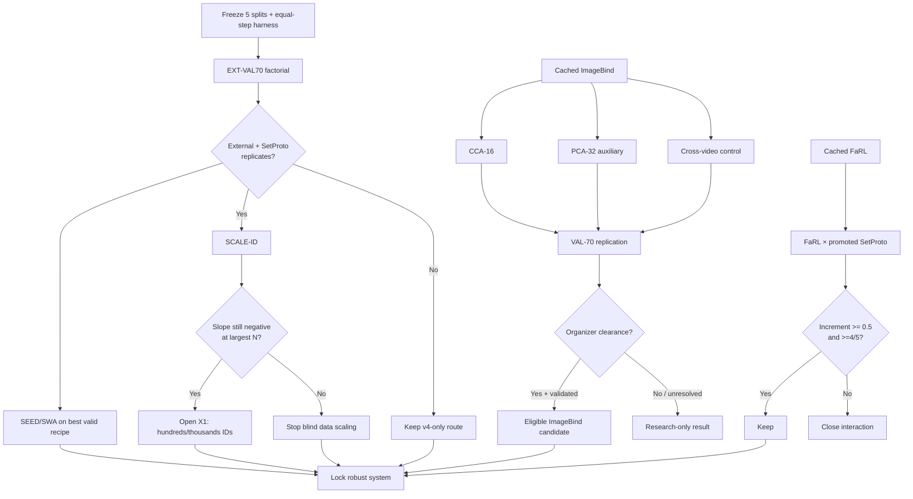
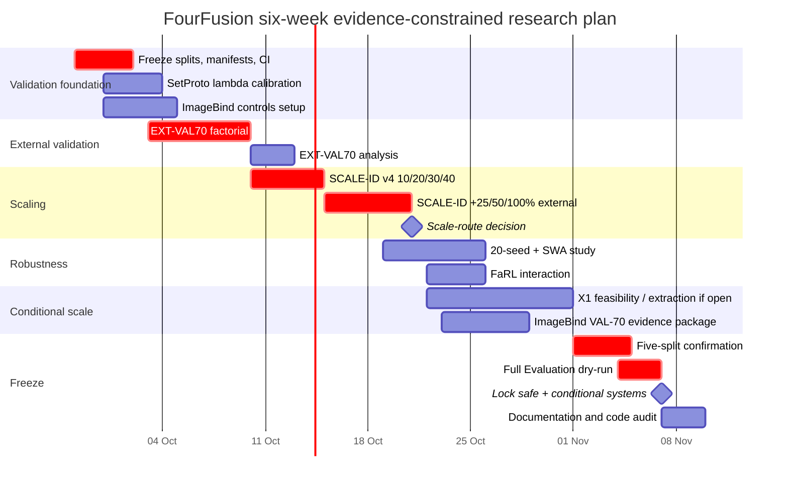

> **Ghi chú của nhóm (29/09).** Báo cáo này viết từ trạng thái khoảng 26–27/09. Các thí nghiệm CPU nó đề xuất **đã được chạy** (nhật ký 74–75):
> - **EXT-VAL70 / SetProto:** SetProto ≈ 0, tương tác SetProto × thêm người ≈ 0 khi cùng ngân sách → giả thuyết trung tâm của báo cáo **không được xác nhận** ([EXTSCALE-01](../Experiment/EXTSCALE-01/README.md)).
> - **SCALE-ID:** cầu nối trần chưa bão hoà tới 161 người; ở bản production (ImageBind + tuổi) bước cuối gần như chỉ còn nhiễu → chưa mở VoxCeleb.
> - **SEED-SWA:** không có tác dụng ([SWA-01](../Experiment/SWA-01/README.md)). **IB-CCA16:** tệ hơn zero-shot ([IB-PROBE](../Experiment/IB-PROBE/README.md)).
> - **Đã lỗi thời trong báo cáo:**
>   - mốc hiện tại là SET-13 21.01, không phải SET-02;
>   - BTC đã cho phép ImageBind (63);
>   - đối chứng cặp dương khác video đã làm (IB-01, VAL-70, STRESS-01 B);
>   - ImageBind huge cho embedding 1024 chiều, không phải 768;
>   - chiều điểm đã đo trên CodaBench;
>   - thước đo chính của ta là mức người / cụm của bản production, không phải mức mẫu (A7).
>
> Trạng thái hiện hành: [DECISIONS.md](DECISIONS.md), [OPEN_DIRECTIONS.md](OPEN_DIRECTIONS.md).

# FourFusion FLAG 2027: Evidence-Constrained Research and Engineering Plan

## Executive summary and engineering checklist

The confirmed evidence now supports a much narrower research program than the earlier architecture search. The current production reference is SET-02 at **21.68 overall EER** with **12.50 / 21.34 / 28.31 / 24.59** for ng/En, ng/Bn, g/En, and g/Bn. The largest improvement so far came from identity/set aggregation, while clustering itself is already close to its useful ceiling; the remaining hard cell is especially **gender-constrained English at 28.31 EER**. fileciteturn0file1 fileciteturn0file5

The decisive new evidence is that **SetProto becomes meaningfully useful when the number of training identities increases**: in the confirmed five-split comparison, B3P versus B3 improves gender sample EER by about **1.13 EER with 5/5 wins**, and no-gender by about **1.61 EER with 5/5 wins**; B3P versus the v4 baseline improves gender by about **1.82 EER with 5/5 wins**. By contrast, residual CCA, low-rank linear/bilinear variants, learned set aggregation, and recognizer-assisted geometry have already produced negative or saturated results and should remain closed. fileciteturn0file4 fileciteturn0file5

This makes the central hypothesis:

\[
\boxed{
\text{generalization quality}
\approx
f(
N_{\text{training identities}},
\text{identity-level objective},
\text{variance control}
)
}
\]

rather than:

\[
\text{generalization quality}
\approx
f(\text{larger bridge architecture}).
\]

That is consistent with the conceptual role of prototype-based metric learning: Prototypical Networks learn representations that can classify previously unseen classes using class means in the learned space. FourFusion's SetProto is **not the original ProtoNet algorithm**, but its identity-prototype auxiliary loss imposes the same useful bias: samples of a person should form a stable representation that generalizes to identities unseen during training. citeturn13search3 Existing FourFusion code already implements multi-positive identity supervision, so there is no reason to reopen “multi-positive InfoNCE” as a new experiment. fileciteturn0file3 fileciteturn0file4

The second high-value path is **ImageBind**, but for a different reason. Internal MODEL-01 results already show a roughly **5.5–8 EER validation signal**, much larger than normal incremental bridge improvements. ImageBind was explicitly pretrained into a shared image/audio space, with the official implementation outputting a common 768-dimensional embedding for modalities including vision and audio. That makes it qualitatively different from an independent pretrained face or voice encoder, which is precisely why official-use legality remains unresolved. fileciteturn0file1 citeturn13search0turn18search1

### Ordered checklist for engineers

1. **Freeze the five outer identity splits, trial files, preprocessing rules, and optimizer-step budget.** Commit them before running anything else.
2. **Build EXT-VAL70 correctly**, with v1/v2 identities held out from external-data training rather than evaluating an external model on identities it has already seen.
3. **Run the SetProto factorial experiment**: v4-only versus v4+external, each with and without SetProto, under exactly equal optimizer steps.
4. **Run SCALE-ID with nested identity subsets**: 10/20/30/40 v4 identities, then 40 v4 plus 25/50/100% of available v1/v2 identities.
5. **Use fixed \(P\times K\) sampling across the SCALE-ID curve** so increasing the number of identities is the variable being measured, not episode size.
6. **Run the twenty-seed study once** on the promoted recipe, deriving 5-, 10-, and 20-model ensembles from those checkpoints; compute SWA from the same runs rather than training separate SWA models.
7. **Finish the ImageBind controls**: CCA-16, PCA-32 auxiliary concatenation, VAL-70 replication, and a cross-video identity control.
8. **Test FaRL × external SetProto only as a cheap interaction study** if the already-extracted FaRL features are available; do not reopen an encoder sweep.
9. **Emit geometry diagnostics for every run**—effective rank, hubness, alignment, and prototype stability—but do not turn them into new losses unless they explain a validated failure.
10. **By early November, lock one safe non-ImageBind system and one conditional ImageBind system**, dry-run the complete Evaluation pipeline, and preserve the existing SET-02 fallback. The official challenge currently lists the Progress Phase through November 10 and Evaluation from November 11–18, 2026, with only 15 Evaluation submissions; the dates are explicitly tentative. citeturn12view0

The following remain **closed in the present data regime**: RDCCA/residual bridge expansion, bilinear/MFB, RelationNet, cross-attention, DeepSets/NAN/GhostVLAD/Set Transformer, DGCCA, MoE, and DSN/source adapters. Source adapters or DSN reopen only if EXT-VAL70 demonstrates **repeatable sample-level negative transfer at equal training budget**; larger bridges reopen only if identity scaling first shows that hundreds of people materially move the ceiling. fileciteturn0file1 fileciteturn0file4

## Experiment portfolio and decision gates

### Common experimental contract

All candidate experiments should share one immutable validation contract.

For each of five speaker-disjoint outer splits:

```text
all identities
     │
     ├── training identities
     │      ├── fit scaler
     │      ├── fit PCA / CCA
     │      ├── train bridge
     │      └── construct SWA
     │
     └── held-out identities
            ├── sample-level EER       ← PRIMARY GATE
            ├── true-prototype EER     ← diagnostic
            └── estimated-cluster EER  ← production diagnostic
```

**Sample EER remains the primary gate.** This follows the latest DECISIONS policy and avoids changing the target merely because prototype aggregation happens to make an architecture look better. Prototype EER is still essential because it tells us whether identity-level geometry improved; cluster EER tells us whether the gain survives the SET-02 production mechanism. fileciteturn0file1

Every comparison must be paired:

\[
\Delta_{s,c}
=
EER_{\text{baseline},s,c}
-
EER_{\text{candidate},s,c},
\]

where positive \(\Delta\) means improvement.

For each candidate report:

\[
\Delta_1,\ldots,\Delta_5,
\quad
\bar\Delta,
\quad
\operatorname{median}(\Delta),
\quad
SD(\Delta),
\quad
\text{wins}/5,
\]

plus an identity-block-bootstrap confidence interval.

The default promotion gate should be:

\[
\boxed{
\bar\Delta \ge 1.0
\quad\land\quad
\text{wins}\ge4/5
}
\]

for a representation/training change on its target protocol, with no systematic companion-protocol regression greater than 0.5 EER. Changes below roughly 0.4–0.5 EER should normally be treated as unresolved because current logs show substantial split and seed variance. fileciteturn0file1 fileciteturn0file5

### Supported experiment matrix

| Experiment | Goal and hypothesis | Required inputs and model | Small grid | Required diagnostics | Promotion / stop rule |
|---|---|---|---|---|---|
| **SP-SCALE: SetProto × more identities** | Test whether the positive B3P effect grows, persists, or saturates as identity count rises | Existing VGGFace-fc7/BTC-192 bridge; current multi-positive row loss + identity prototype loss; P×K sampler | `w_proto={0.25,0.5,1.0}` only in a short calibration; then freeze best value. `K=4`, prototype subset size 2–4 | sample/prototype/cluster EER; effective rank; prototype within-ID variance; hubness; paired Δ | Promote if SetProto beats row-only at larger N by ≥1 EER, ≥4/5 splits; stop tuning `w_proto` after calibration |
| **EXT-VAL70** | Establish whether v1/v2 genuinely improve unseen identities and languages when evaluation identities are absent from training | 70 v4 identities + 4/5 external identity folds; validate held-out external speakers in English and Urdu/Hindi | Four factorial arms: v4-row, v4-SP, v4+ext-row, v4+ext-SP. Optional source-balanced control only | sample EER primary; English/Urdu/Hindi; prototype EER; cluster EER; Δ across folds; source gradient optional | Promote external route if external+SP wins ≥4/5 and improves target sample EER ≥1 while heard-language regression ≤0.5 |
| **SCALE-ID** | Measure \(\partial EER/\partial N_{\rm IDs}\) before committing to VoxCeleb-scale extraction | Fixed 30-v4-person holdout; nested train subsets 10/20/30/40; then 40 + 25/50/100% v1/v2 | **No architecture sweep.** Fixed P=8, K=4, fixed steps, fixed recipe | all EER levels; slope; marginal gain per added identity; effective rank; hubness | Open X1/VoxCeleb if the last scale increment still gives ≥0.5 EER, ≥4/5 splits; deprioritize scale if curve is statistically flat |
| **SEED-SWA** | Determine how much measured Evaluation risk comes from optimization variance and whether weight averaging reduces it | One promoted recipe, 20 predefined seeds on each split | raw checkpoint; average epochs 31–40; optional `SWA start=30` with fixed SWA LR; ensembles n=5/10/20 | mean EER; SD across seeds; paired raw→SWA Δ; correlation of errors across seeds | Keep SWA if mean does not regress >0.2 and seed SD falls ≥20%, or mean improves ≥0.5 consistently |
| **IB-CCA16** | Test whether a train-only low-dimensional calibration extracts more identity signal from already-strong frozen ImageBind | Cached ImageBind 768-d face/audio embeddings; train identities only | PCA `{32,64}` before CCA if needed; CCA dimension fixed at 16; regularization `{1e-3,1e-2}` | sample/prototype EER; cross-video control; canonical spectrum; paired Δ | Research promotion if ≥0.5 extra gain over frozen IB, ≥4/5; **never official submission before organizer clearance** |
| **IB-PCA32-AUX** | Test whether ImageBind provides complementary information without allowing a high-capacity new bridge | `VGG PCA256 + IB PCA32` face; `BTC192 + IB PCA32` voice; same existing bridge | PCA fixed at 32; no hidden-size sweep | EER levels; correlation with baseline score; paired Δ; hubness | Keep if ≥0.5 EER and ≥4/5, with independent VAL-70 confirmation |
| **IB-XVID control** | Determine whether ImageBind gain is person identity or audiovisual/session/co-occurrence signal | Same frozen embeddings, positives forced to different videos when identity metadata permits | None | same-video versus cross-video Δ | If most gain disappears cross-video, label effect session/co-occurrence-dependent and do not interpret it as identity-bridge evidence |
| **FaRL × SP-scale** | Test whether the already-positive FaRL stream is complementary to external-data SetProto rather than overlapping it | Cached FaRL stream + promoted external SP recipe | Existing frozen FaRL recipe only; no new encoder tuning | sample EER primary; paired Δ; score correlation | Keep only if incremental gain ≥0.5, ≥4/5, with no >0.5 regression |

The SetProto branch should remain deliberately simple. The existing row loss is already multi-positive by identity; the confirmed implementation uses the same-person mask rather than treating off-diagonal same-person samples as negatives. SetProto therefore adds **identity-level aggregation pressure**, not a fundamentally new contrastive loss. fileciteturn0file3 Contrastive learning through probabilistic positive-vs-negative discrimination is consistent with the InfoNCE family introduced in Contrastive Predictive Coding, but there is no reason to change loss families merely for novelty when loss sweeps have already saturated. citeturn13academia24

### EXT-VAL70 as a factorial test

EXT-VAL70 should not be implemented as another vague “external data helps/does not help” run. It should estimate two effects separately:

\[
\Delta_{\rm external}
=
E(v4)-E(v4+ext)
\]

and

\[
\Delta_{\rm SP|ext}
=
E(v4+ext,row)-E(v4+ext,SP).
\]

Even more useful is the interaction:

\[
I =
\left[
E(v4+ext,row)-E(v4+ext,SP)
\right]
-
\left[
E(v4,row)-E(v4,SP)
\right].
\]

If \(I>0\) consistently, the current hypothesis is confirmed directly:

> SetProto becomes more useful as the identity population grows.

The external split must be at **person level before any scaler/PCA/model fitting**. v1 and v2 should each contribute held-out people on every fold so English→Urdu and English→Hindi can be measured independently. Use the **same held-out face pool** for English and non-English voice trials; otherwise language change is confounded with a face-session/domain change. The official FLAG design explicitly measures heard versus unheard languages on identities unseen at test time, while gender-constrained negatives are same-gender. citeturn12view0

Use source-balanced identity sampling as the production external recipe:

```text
50% episode identities: v4
25%: v1
25%: v2
```

but preserve one natural-frequency arm on a reduced calibration subset to check whether source balancing itself matters. Most importantly, **all arms get the same number of optimizer updates**. Earlier external-data experiments can otherwise receive much more optimization simply because their row count is larger, producing a training-budget confound. fileciteturn0file3

### SCALE-ID as the go/no-go test for VoxCeleb-scale work

SCALE-ID should use **nested speaker subsets**:

```text
fixed held-out v4 identities: 30

training:
  10 v4
  20 v4
  30 v4
  40 v4
  40 v4 + 25% available v1/v2 IDs
  40 v4 + 50% available v1/v2 IDs
  40 v4 + 100% available v1/v2 IDs
```

The subsets must be nested:

\[
S_{10}\subset S_{20}\subset S_{30}\subset S_{40},
\]

and external subsets must also be nested. This makes the curve interpretable.

Critically, keep **P fixed at 8** for the entire curve. Allowing \(P\) to grow from 8 to 24 as identities increase would confound “more total identities” with “more identities per gradient update.”

The analysis should fit, for descriptive purposes only,

\[
E(N)=E_\infty+aN^{-\alpha},
\]

but the go/no-go decision should rely on paired observed increments, not an extrapolated asymptote. A seven-point curve is too small to treat \(E_\infty\) as a trustworthy prediction.

The key decision is the last derivative:

\[
\Delta_{50\%\rightarrow100\%}
=
E(N_{50\%})-E(N_{100\%}).
\]

If that remains clearly positive across splits, extracting hundreds or thousands more identities is rational. If it is already approximately zero, VoxCeleb-scale extraction is much less likely to close the remaining g/English gap.

## Reproducible implementation on A100 and Kaggle T4

### Data and preprocessing invariants

The official v4 training release has **70 identities and 6,485 paired English rows**, with 4,096-dimensional face features and 192-dimensional voice features; raw `.jpg` and `.wav` data are also supplied. citeturn12view0 The current FourFusion bridge has already reproduced the organizer/BTC feature space and should retain it for these experiments. fileciteturn0file1

For every outer fold:

```text
VGGFace fc7 4096
      │
      ├─ StandardScaler.fit(TRAIN ONLY)
      │
      └─ PCA(n_components=256).fit(TRAIN ONLY)
               ↓
            face256
               ↓
        MLP 256 → 512 → 128
        dropout = 0.30
               ↓
            L2 normalize


BTC voice 192
      │
      └─ StandardScaler.fit(TRAIN ONLY)
               ↓
        MLP 192 → 512 → 128
        dropout = 0.30
               ↓
            L2 normalize
```

Retain the current temperature:

\[
\tau=0.07
\]

and current dedup policy:

```text
dedup = False
```

unless the repository state differs; the committed training implementation is the source of truth. The project has already found keeping duplicate voice rows useful and architecture/loss sweeps around this bridge have largely saturated. fileciteturn0file5

A robust preprocessing manifest should record:

```json
{
  "outer_split": 0,
  "train_identity_sha256": "...",
  "valid_identity_sha256": "...",
  "scaler_fit_ids": "...",
  "pca_fit_ids": "...",
  "face_pca_dim": 256,
  "seed": 101,
  "fixed_optimizer_steps": 2560
}
```

Any run where `fit_ids ∩ valid_ids != ∅` should hard-fail.

### P×K sampling

For the definitive SP experiments:

```text
normal EXT-VAL70:
    P = 24 identities
    K_face = 4
    K_voice = 4

SCALE-ID:
    P = 8 identities       # fixed because smallest train set is 10
    K_face = 4
    K_voice = 4

sampling:
    identities uniform within chosen source
    face and voice samples selected independently inside identity
```

For every identity \(i\), define row embeddings:

\[
F_i=\{z^f_{i1},\ldots,z^f_{iK}\},
\qquad
V_i=\{z^v_{i1},\ldots,z^v_{iK}\}.
\]

The row loss remains the existing identity multi-positive contrastive loss.

For SetProto, independently choose 2–4 members from each modality, seeded reproducibly:

\[
p_i^f=
\operatorname{norm}
\left(
\frac1{|S_i^f|}
\sum_{j\in S_i^f}z^f_{ij}
\right),
\]

\[
p_i^v=
\operatorname{norm}
\left(
\frac1{|S_i^v|}
\sum_{j\in S_i^v}z^v_{ij}
\right).
\]

Then:

\[
S_{ij}=\frac{p_i^f\cdot p_j^v}{\tau}
\]

and

\[
L_{\rm proto}
=
\frac12[
CE(S,\operatorname{diag})
+
CE(S^\top,\operatorname{diag})
].
\]

Total objective:

\[
\boxed{
L=L_{\rm row}+\lambda_pL_{\rm proto}
}
\]

with `λp=0.5` as the default after the short calibration.

### Hardware-specific execution

A100 supports native BF16 and FP16 Tensor Core computation and is available in 40- and 80-GB configurations; T4 has 16 GB GDDR6 and hardware acceleration for FP16 but is a substantially smaller Turing-generation device. citeturn16search6turn17search0

| Setting | A100 | Kaggle T4 |
|---|---|---|
| Feature-only bridge precision | BF16 autocast; FP32 loss/scaler/PCA | FP16 autocast; FP32 loss/scaler/PCA |
| P×K | Same research config; do **not** inflate P because GPU is larger | Same P×K |
| Peak reserved VRAM, feature runs | 2 GB/process | 2 GB/process |
| Parallel jobs/GPU | 2–4 tiny feature jobs if CPU feeds them; benchmark first | 1 process/GPU |
| Dual-GPU strategy | independent fold/seed jobs | one job per T4 |
| DDP for bridge | **No**; overhead dominates | **No** |
| ImageBind cached probes | CPU/GPU unnecessary except bridge training | same |
| ImageBind re-extraction | shard files by GPU; BF16 where validated | batch 1, FP16, smoke-test VRAM first |
| DataLoader workers | 2–4 per process | 2 per process |
| PCA/CCA | CPU FP64/FP32, fold-local | CPU FP64/FP32 |

For tiny feature models, **experiment parallelism is superior to model parallelism**:

```text
GPU 0: split0 / seeds 1, 2, ...
GPU 1: split1 / seeds 1, 2, ...
GPU 2: split2 / ...
...
```

With two Kaggle T4s:

```text
T4-0 → queue A
T4-1 → queue B
```

Do not use DDP to train one 200k-parameter bridge across both T4s.

### Training and checkpoint policy

Use a fixed step budget rather than letting dataset size determine update count:

```yaml
epochs: 40
steps_per_epoch: 64
optimizer_steps: 2560
optimizer: AdamW
lr: 3.0e-4
weight_decay: 1.0e-4
grad_clip: 1.0
temperature: 0.07
dropout: 0.30
```

If the current repository's exact optimizer differs, preserve the repository setting and record that as the reproducibility source rather than silently changing it.

Save:

```text
epoch_10.pt
epoch_20.pt
epoch_25.pt
epoch_30.pt
epoch_31.pt
...
epoch_40.pt
best_inner.pt
last.pt
swa_31_40.pt
```

Each checkpoint metadata should contain:

```text
git commit
config hash
fold
seed
train ID hash
external ID hash
optimizer step
preprocessing hashes
feature manifest hashes
CUDA/PyTorch versions
```

### SWA recipe

SWA averages points along a training trajectory and was originally proposed as a low-overhead way to improve generalization; PyTorch provides `AveragedModel`, `SWALR`, and `update_bn` utilities directly. citeturn10academia24turn11search1

FourFusion should test two versions, in this order.

**Checkpoint averaging — primary low-risk test**

```text
average epoch 31 ... epoch 40 weights
```

No changed LR, no changed training trajectory, therefore it answers the cleanest question:

> Does averaging the already-existing trajectory reduce seed variance?

**Formal SWA — secondary**

```yaml
start_epoch: 30
swa_lr: 1.0e-4
anneal_epochs: 2
anneal_strategy: cosine
```

If the bridge has no BatchNorm, `update_bn` is unnecessary. If future models include BatchNorm, recompute BN statistics using **training identities only**, as recommended in PyTorch's SWA documentation. citeturn11search1

## Reference implementation skeletons

### SetProto training loop

```python
from __future__ import annotations

import torch
import torch.nn.functional as F
from torch import Tensor


def l2n(x: Tensor) -> Tensor:
    return F.normalize(x, dim=-1)


def symmetric_proto_loss(
    face_proto: Tensor,
    voice_proto: Tensor,
    temperature: float = 0.07,
) -> Tensor:
    """P face prototypes and P voice prototypes, aligned by identity."""
    logits = l2n(face_proto) @ l2n(voice_proto).T / temperature
    targets = torch.arange(logits.shape[0], device=logits.device)

    return 0.5 * (
        F.cross_entropy(logits, targets)
        + F.cross_entropy(logits.T, targets)
    )


def random_prototypes(
    z: Tensor,                 # [P, K, D]
    generator: torch.Generator,
    min_k: int = 2,
) -> Tensor:
    P, K, _ = z.shape
    protos = []

    for p in range(P):
        k = int(
            torch.randint(
                min_k,
                K + 1,
                (1,),
                generator=generator,
            ).item()
        )
        idx = torch.randperm(K, generator=generator)[:k].to(z.device)
        protos.append(z[p, idx].mean(dim=0))

    return l2n(torch.stack(protos))


def train_step(model, batch, optimizer, cfg, generator):
    # Expected shapes: [P, K, input_dim]
    xf = batch["face"].cuda(non_blocking=True)
    xv = batch["voice"].cuda(non_blocking=True)

    P, Kf, Df = xf.shape
    _, Kv, Dv = xv.shape

    with torch.autocast(
        device_type="cuda",
        dtype=cfg.amp_dtype,
        enabled=cfg.use_amp,
    ):
        zf = model.face(xf.reshape(P * Kf, Df)).reshape(P, Kf, -1)
        zv = model.voice(xv.reshape(P * Kv, Dv)).reshape(P, Kv, -1)

        # Existing FourFusion identity-multi-positive row loss.
        ids_f = torch.arange(P, device=xf.device).repeat_interleave(Kf)
        ids_v = torch.arange(P, device=xv.device).repeat_interleave(Kv)

        loss_row = multi_positive_cross_modal_loss(
            zf.reshape(P * Kf, -1),
            zv.reshape(P * Kv, -1),
            ids_f,
            ids_v,
            temperature=cfg.temperature,
        )

        pf = random_prototypes(zf, generator)
        pv = random_prototypes(zv, generator)
        loss_proto = symmetric_proto_loss(
            pf, pv, temperature=cfg.temperature
        )

        loss = loss_row + cfg.w_proto * loss_proto

    optimizer.zero_grad(set_to_none=True)
    loss.backward()
    torch.nn.utils.clip_grad_norm_(model.parameters(), cfg.grad_clip)
    optimizer.step()

    return {
        "loss": float(loss.detach()),
        "loss_row": float(loss_row.detach()),
        "loss_proto": float(loss_proto.detach()),
    }
```

A regression test must assert that `w_proto=0` and the default non-PK sampler reproduce the existing training path. The project has already performed such a bit-identical regression check after adding SetProto support; preserve that test permanently. fileciteturn0file3

### EXT-VAL70 fold creation

```python
from __future__ import annotations

from dataclasses import dataclass
import numpy as np
import pandas as pd
from sklearn.model_selection import StratifiedKFold


@dataclass(frozen=True)
class IdentityFold:
    fold: int
    train_external_ids: tuple[str, ...]
    valid_external_ids: tuple[str, ...]


def make_external_identity_folds(
    speaker_meta: pd.DataFrame,
    n_splits: int = 5,
    seed: int = 20260928,
) -> list[IdentityFold]:
    """
    speaker_meta: one row per canonical identity.
    Required: speaker_id, source.
    Optional stratification: gender.
    """
    required = {"speaker_id", "source"}
    missing = required - set(speaker_meta.columns)
    if missing:
        raise ValueError(f"missing columns: {sorted(missing)}")

    meta = speaker_meta.drop_duplicates("speaker_id").reset_index(drop=True)

    if "gender" in meta:
        strata = meta["source"].astype(str) + "_" + meta["gender"].astype(str)
    else:
        strata = meta["source"].astype(str)

    skf = StratifiedKFold(
        n_splits=n_splits,
        shuffle=True,
        random_state=seed,
    )

    folds = []
    for fold, (tr, va) in enumerate(skf.split(meta, strata)):
        train_ids = tuple(meta.iloc[tr]["speaker_id"])
        valid_ids = tuple(meta.iloc[va]["speaker_id"])

        assert set(train_ids).isdisjoint(valid_ids)

        folds.append(
            IdentityFold(
                fold=fold,
                train_external_ids=train_ids,
                valid_external_ids=valid_ids,
            )
        )

    return folds
```

Then each fold trains on:

```python
train_ids = all_v4_train_ids | set(fold.train_external_ids)
valid_ids = set(fold.valid_external_ids)
```

and the preprocessing API should require `fit_ids=train_ids` explicitly.

Validation construction should produce:

```text
heldout_v1_English
heldout_v1_Urdu
heldout_v2_English
heldout_v2_Hindi
```

with fixed held-out face pools across each language pair.

### SCALE-ID runner

```python
SCALE_POINTS = [
    {"name": "v4_10",      "n_v4": 10, "ext_frac": 0.00},
    {"name": "v4_20",      "n_v4": 20, "ext_frac": 0.00},
    {"name": "v4_30",      "n_v4": 30, "ext_frac": 0.00},
    {"name": "v4_40",      "n_v4": 40, "ext_frac": 0.00},
    {"name": "v4_40_e25",  "n_v4": 40, "ext_frac": 0.25},
    {"name": "v4_40_e50",  "n_v4": 40, "ext_frac": 0.50},
    {"name": "v4_40_e100", "n_v4": 40, "ext_frac": 1.00},
]


def nested_prefix(ids: list[str], n: int, seed: int) -> list[str]:
    rng = np.random.default_rng(seed)
    ordered = np.asarray(ids)[rng.permutation(len(ids))]
    return ordered[:n].tolist()


for split in range(5):
    # Fixed 30-person heldout set for this outer split.
    train_v4, heldout_v4 = split_registry[split]

    # Freeze one random identity ordering; all smaller sets are prefixes.
    ordered_v4 = nested_prefix(train_v4, len(train_v4), seed=1000 + split)
    ordered_ext = nested_prefix(
        external_train_ids,
        len(external_train_ids),
        seed=2000 + split,
    )

    for point in SCALE_POINTS:
        v4_ids = ordered_v4[:point["n_v4"]]
        n_ext = round(point["ext_frac"] * len(ordered_ext))
        ext_ids = ordered_ext[:n_ext]

        for seed in PREDECLARED_SEEDS:
            run_training(
                train_v4_ids=v4_ids,
                train_external_ids=ext_ids,
                valid_v4_ids=heldout_v4,
                sampler_P=8,       # MUST remain fixed across N
                sampler_K=4,
                optimizer_steps=2560,
                seed=seed,
            )
```

Do **not** optimize `P`, hidden size, epochs, or learning rate separately for different scale points.

### SWA averaging

```python
from copy import deepcopy
import torch
from torch.optim.swa_utils import AveragedModel


def build_checkpoint_swa(model_factory, paths):
    model = model_factory()
    swa = AveragedModel(model)

    for path in paths:
        state = torch.load(path, map_location="cpu")
        model.load_state_dict(state["model"])
        swa.update_parameters(model)

    return swa


swa_model = build_checkpoint_swa(
    model_factory,
    [f"epoch_{e}.pt" for e in range(31, 41)],
)
torch.save(
    {"model": swa_model.module.state_dict()},
    "swa_31_40.pt",
)
```

For formal training-time SWA:

```python
from torch.optim.swa_utils import AveragedModel, SWALR

swa_model = AveragedModel(model)
swa_scheduler = SWALR(
    optimizer,
    swa_lr=1e-4,
    anneal_epochs=2,
    anneal_strategy="cos",
)

for epoch in range(40):
    train_epoch(...)

    if epoch >= 30:
        swa_model.update_parameters(model)
        swa_scheduler.step()
    else:
        base_scheduler.step()
```

PyTorch's official utilities implement equal-weight SWA through `AveragedModel` by default. citeturn11search1

### ImageBind CCA probe

ImageBind's official implementation uses `out_embed_dim=768` for the shared modality output. citeturn18search1 CCA itself originates from Hotelling's formulation of relations between two sets of variates. citeturn9search2

The probe must be fit strictly on train identities:

```python
import numpy as np
from sklearn.cross_decomposition import CCA
from sklearn.decomposition import PCA
from sklearn.preprocessing import StandardScaler
from sklearn.pipeline import make_pipeline


class ImageBindCCA:
    def __init__(self, pca_dim=64, cca_dim=16):
        self.face_pre = make_pipeline(
            StandardScaler(),
            PCA(pca_dim, whiten=False, random_state=0),
        )
        self.voice_pre = make_pipeline(
            StandardScaler(),
            PCA(pca_dim, whiten=False, random_state=0),
        )
        self.cca = CCA(
            n_components=cca_dim,
            scale=False,
            max_iter=2000,
            tol=1e-6,
        )

    def fit(self, f_train, v_train):
        f = self.face_pre.fit_transform(f_train)
        v = self.voice_pre.fit_transform(v_train)
        self.cca.fit(f, v)
        return self

    def transform(self, f, v):
        f = self.face_pre.transform(f)
        v = self.voice_pre.transform(v)
        zf, zv = self.cca.transform(f, v)
        zf /= np.linalg.norm(zf, axis=1, keepdims=True) + 1e-12
        zv /= np.linalg.norm(zv, axis=1, keepdims=True) + 1e-12
        return zf, zv
```

Do **not** fit CCA on VAL-70, development, or estimated clusters.

Because frozen ImageBind already produced a large internal gain, a critical companion is:

```text
same identity, same video
vs
same identity, different video
```

If the cross-video signal remains large, that strongly supports identity-level transfer. If it collapses, the embedding is probably exploiting audiovisual context/session cues as part of its score. That may still be useful operationally, but it is a different scientific mechanism and should be reported as such.

ImageBind learns a joint space across vision, audio and four other modalities, rather than independent unimodal spaces; its official code/model weights are licensed CC-BY-NC 4.0. citeturn13search0turn15view0 FLAG's public rules currently say that a pretrained **face or voice encoder** is allowed and require disclosure of pretrained models and extra data, but do not explicitly resolve a pretrained *joint image–audio alignment model*. Therefore ImageBind remains a research-only branch until the organizers answer that question. citeturn11search5

### Paired evaluation and identity bootstrap

```python
from __future__ import annotations

import numpy as np
import pandas as pd
from sklearn.metrics import roc_curve


def eer_percent(y_true, score_same):
    fpr, tpr, _ = roc_curve(y_true, score_same)
    fnr = 1.0 - tpr
    i = np.nanargmin(np.abs(fpr - fnr))
    return 100.0 * (fpr[i] + fnr[i]) / 2.0


def paired_identity_bootstrap(
    df: pd.DataFrame,
    baseline_col: str,
    candidate_col: str,
    group_col: str = "face_identity",
    n_boot: int = 5000,
    seed: int = 20260928,
):
    """
    Identity/block bootstrap, not trial bootstrap.
    Positive Δ = candidate is better.
    """
    rng = np.random.default_rng(seed)
    groups = df[group_col].drop_duplicates().to_numpy()

    deltas = []

    for _ in range(n_boot):
        sampled = rng.choice(groups, size=len(groups), replace=True)

        blocks = []
        for new_idx, gid in enumerate(sampled):
            block = df[df[group_col] == gid].copy()
            # Relabel duplicate resampled blocks so each occurrence counts.
            block["_boot_group"] = new_idx
            blocks.append(block)

        boot = pd.concat(blocks, ignore_index=True)

        e0 = eer_percent(boot["label"], boot[baseline_col])
        e1 = eer_percent(boot["label"], boot[candidate_col])
        deltas.append(e0 - e1)

    q = np.quantile(deltas, [0.025, 0.5, 0.975])

    return {
        "delta_mean": float(np.mean(deltas)),
        "ci025": float(q[0]),
        "median": float(q[1]),
        "ci975": float(q[2]),
    }


def paired_split_summary(results):
    # one row / outer split / protocol
    d = results.copy()
    d["delta"] = d["eer_baseline"] - d["eer_candidate"]

    return {
        "mean_delta": d.delta.mean(),
        "median_delta": d.delta.median(),
        "sd_delta": d.delta.std(ddof=1),
        "wins": int((d.delta > 0).sum()),
        "n_splits": len(d),
    }
```

Bootstrap at the identity/block level because trials involving the same person are not independent. If trial construction has a meaningful face-anchor/voice-anchor asymmetry, report the face-anchor bootstrap as primary and voice-anchor bootstrap as a sensitivity check.

### Geometry diagnostics

Effective rank:

\[
r_{\rm eff}
=
\exp
\left(
-\sum_i p_i\log p_i
\right),
\qquad
p_i=\frac{\lambda_i}{\sum_j\lambda_j}.
\]

Participation ratio:

\[
r_{\rm PR}
=
\frac{(\sum_i\lambda_i)^2}
{\sum_i\lambda_i^2}.
\]

Hubness for every gallery prototype \(j\):

\[
N_k(j)
=
\#\{
q:j\in kNN(q)
\}.
\]

Store:

```text
effective_rank_face
effective_rank_voice
participation_ratio_face
participation_ratio_voice
hub_gini_face
hub_gini_voice
hub_max_in_degree
hub_top5pct_mass
mutual_knn_rate
within_id_variance_face
within_id_variance_voice
```

These are **diagnostics**, not optimization objectives. Existing CSLS/hub corrections did not survive the production fusion reliably, so geometry should first explain an error pattern before spawning another training loss. fileciteturn0file5

## Compute budget, repository, environment, and CI

### Compute assumptions

The exact number and SKU of available A100 GPUs is **unspecified**. The table below therefore gives **reserved planning budgets**, not benchmark claims. It assumes:

```text
cached VGG/BTC/FaRL/ImageBind features
40 epochs
64 steps/epoch
2,560 optimizer updates/run
5 outer splits
3 seeds for model-comparison experiments
```

The feature bridge is tiny; existing EXT runs in the project already completed individual arms/splits in roughly minutes even on local compute, so I/O, Python startup, trial construction, and evaluation can be comparable to the neural-network computation itself. fileciteturn0file3

Before the full queue, benchmark 500 training steps on each target machine and replace the planning constants below with measured throughput.

| Experiment | Runs | A100 reserved GPU-h | T4 reserved GPU-h | Feature-run peak VRAM | Notes |
|---|---:|---:|---:|---:|---|
| SetProto `λ` calibration | 18 | **0.6 h** | **1.2 h** | <2 GB | 3 λ × 2 calibration splits × 3 seeds |
| EXT-VAL70 full factorial | 60 | **2.0 h** | **4.0 h** | <2 GB | 4 arms × 5 folds × 3 seeds |
| SCALE-ID | 105 | **3.5 h** | **7.0 h** | <2 GB | 7 scale points × 5 splits × 3 seeds |
| SEED-SWA | 100 base trainings | **3.5 h** | **7.0 h** | <2 GB | 20 seeds × 5 splits; checkpoint SWA adds negligible compute |
| FaRL interaction | 15 | **0.5 h** | **1.0 h** | <2 GB | 5 splits × 3 seeds |
| Geometry diagnostics | — | **0 GPU-h** | **0 GPU-h** | — | 0.5–1.5 CPU-h depending bootstrap |
| IB-CCA16 cached | 5 folds | **0 GPU-h** | **0 GPU-h** | — | PCA/CCA CPU; usually minutes |
| IB-PCA32 bridge | 15 | **0.5 h** | **1.0 h** | <2 GB | cached ImageBind embeddings |
| IB-XVID control | — | **0 GPU-h** | **0 GPU-h** | — | score/eval only if embeddings cached |
| **Total supported feature research** | — | **~10.6 A100 GPU-h** | **~21.2 T4 GPU-h** | — | before optional raw re-extraction |

With four A100s, do not make one training job use all four GPUs. Dispatch independent runs:

```text
GPU0 → split 0/seed queue
GPU1 → split 1/seed queue
GPU2 → split 2/seed queue
GPU3 → splits 3–4/seed queue
```

The ~10.6 GPU-hour feature budget then has a theoretical hardware-time lower bound of about 2.7 hours, but preprocessing, process startup and CPU evaluation will prevent perfect scaling.

With dual T4, the ~21.2 GPU-hour budget is roughly 10.6 dual-GPU hours before overhead.

### ImageBind re-extraction contingency

If the existing ImageBind embeddings are complete and reproducible, **do not re-extract them for these probes**.

If re-extraction becomes necessary, reserve separately:

| Work | A100 | T4 |
|---|---:|---:|
| v4 train + validation raw ImageBind extraction | 2–4 GPU-h | 8–12 GPU-h |
| Batch | 4–8 initially | 1 initially |
| Reserved VRAM | 24 GB | entire 16-GB T4 budget |

Those are deliberately conservative engineering allocations, not measured FourFusion benchmarks. Run a 100-image/100-audio smoke test first. The official ImageBind repository recommends Python 3.10 and PyTorch 2.0 or later. citeturn15view0

### Repository structure

```text
FourFusion_FLAG2027/
├── configs/
│   ├── base_bridge.yaml
│   ├── setproto.yaml
│   ├── ext_val70.yaml
│   ├── scale_id.yaml
│   ├── seed_swa.yaml
│   └── imagebind_probe.yaml
│
├── data_manifests/
│   ├── v4_identities.csv
│   ├── external_identities.csv
│   ├── outer_splits_v1.json
│   ├── ext_folds_v1.json
│   └── feature_manifest.json
│
├── src/
│   ├── data/
│   │   ├── store.py
│   │   ├── pk_sampler.py
│   │   └── trials.py
│   ├── models/
│   │   ├── bridge.py
│   │   └── setproto.py
│   ├── training/
│   │   ├── train.py
│   │   ├── losses.py
│   │   └── swa.py
│   ├── evaluation/
│   │   ├── eer.py
│   │   ├── bootstrap.py
│   │   ├── diagnostics.py
│   │   └── clustering.py
│   └── probes/
│       └── imagebind_cca.py
│
├── Experiment/
│   ├── EXT-VAL70/
│   ├── SCALE-ID/
│   ├── SEED-SWA/
│   ├── IB-PROBE/
│   └── FARL-SP/
│
├── kaggle/
│   ├── FLAG_12_EXT_VAL70.ipynb
│   ├── FLAG_13_SCALE_ID.ipynb
│   ├── FLAG_14_SEED_SWA.ipynb
│   └── FLAG_15_IMAGEBIND_CTRL.ipynb
│
├── reports/
│   ├── tables/
│   └── figures/
│
└── tests/
    ├── test_split_leakage.py
    ├── test_pk_sampler.py
    ├── test_loss_regression.py
    ├── test_equal_budget.py
    ├── test_swa.py
    ├── test_cca_leakage.py
    ├── test_eer.py
    └── test_submission_pipeline.py
```

Do not store or redistribute raw challenge data or pre-extracted challenge features in the public repository; the official challenge rules prohibit redistribution. citeturn11search5

### Core environment

Use a separate **feature-research environment** from ImageBind.

```yaml
name: flag-core
channels:
  - conda-forge
dependencies:
  - python=3.12
  - pip
  - pip:
      - torch==2.14.0
      - scikit-learn==1.9.1
      - scipy==1.18.1
      - pandas==3.0.6
      - matplotlib==3.11.2
      - pyyaml
      - pytest
      - tqdm
      - joblib
```

PyTorch 2.14.0 was released September 2, 2026 and supports Python 3.10 or later; scikit-learn 1.9.1 was released September 10, 2026; SciPy 1.18.1 and pandas 3.0.6 are current 2026 releases. citeturn14search0turn11search0turn14search1turn19search0 Matplotlib 3.11.2 was released September 11, 2026. citeturn19search1

After the first successful smoke test, generate a platform lock file rather than relying indefinitely on these top-level pins:

```bash
pip freeze > env/requirements-lock.txt
python -m pip check
```

For ImageBind:

```yaml
name: flag-imagebind
channels:
  - conda-forge
dependencies:
  - python=3.10
  - pip
```

Then install the official ImageBind repository at a **specific recorded commit**, followed by its own requirements. The official project explicitly recommends Python 3.10 and PyTorch 2.0+, and its code/weights use CC-BY-NC 4.0. citeturn15view0 Do not force the modern scientific-stack environment into the ImageBind environment unless a smoke test proves compatibility.

### CI tests that must block merges

| CI test | Required assertion |
|---|---|
| `test_split_leakage` | train, validation, and external-held-out identities are pairwise disjoint |
| `test_preprocessor_fit_ids` | scaler/PCA/CCA `fit_ids` exactly equal registered train IDs |
| `test_pk_sampler` | exactly P identities, K observations/identity; face/voice selections independently sampled |
| `test_scale_fixed_episode` | every SCALE-ID point uses identical P, K, steps, LR, hidden dims |
| `test_equal_budget` | external and v4-only arms execute equal optimizer step counts |
| `test_multi_positive` | every same-ID cross-modal pair is positive, not just diagonal |
| `test_setproto_off` | `w_proto=0` reproduces previous training path within agreed tolerance |
| `test_swa_average` | synthetic checkpoints average to analytically known weights |
| `test_eer` | synthetic scores produce known EER and score direction |
| `test_bootstrap_pairing` | baseline/candidate use identical bootstrap identity samples |
| `test_imagebind_no_val_fit` | PCA/CCA fit never receives held-out/VAL-70 indices |
| `test_best_pipeline` | frozen SET-02 reconstruction retains rank correlation 1.000 with reference |

The existing production pipeline has already been reconstructed at rank correlation 1.000 across all four SET-02 cells, providing a strong regression anchor. fileciteturn0file3

## Reporting visuals and six-week schedule

### Mandatory visuals

The final experimental report should contain, at minimum:

| Visual | Purpose |
|---|---|
| **SCALE-ID learning curve** | EER versus number of training identities, one line each for row-only and SetProto |
| **Marginal-scale curve** | paired improvement from each identity increment |
| **Paired Δ boxplot/strip plot** | expose whether gains are consistent across splits rather than driven by one split |
| **Seed-variance violin/boxplot** | raw versus SWA, plus 5/10/20 ensembles |
| **EXT-VAL70 language matrix** | English, Urdu and Hindi sample EER by arm |
| **Sample → prototype → cluster table** | locate where each gain appears/disappears |
| **Effective-rank and hubness table** | diagnose representation geometry |
| **ImageBind same-video vs cross-video chart** | separate person signal from audiovisual context |
| **Compute table** | actual GPU-hours after benchmark, not just planned budget |

The report should **not fabricate a SCALE-ID curve now**, because those measurements do not yet exist. The exact plotting code should ship with the experiment so figures are generated automatically from `results.csv`.

### Scaling-curve chart generator

```python
import pandas as pd
import matplotlib.pyplot as plt

df = pd.read_csv("Experiment/SCALE-ID/results.csv")

summary = (
    df.groupby(["n_train_ids", "setproto"])["sample_eer_g"]
      .agg(["mean", "std"])
      .reset_index()
)

fig, ax = plt.subplots(figsize=(7, 4))

for sp, g in summary.groupby("setproto"):
    label = "SetProto" if sp else "Row loss"
    ax.errorbar(
        g["n_train_ids"],
        g["mean"],
        yerr=g["std"],
        marker="o",
        capsize=3,
        label=label,
    )

ax.set_xlabel("Training identities")
ax.set_ylabel("Gender-constrained sample EER (%)")
ax.set_title("SCALE-ID: identity scaling")
ax.legend()
fig.tight_layout()
fig.savefig("reports/figures/scale_id_curve.png", dpi=180)
```

No fixed chart colors are required; plotting defaults are sufficient.

### Paired-Δ chart generator

```python
import pandas as pd
import matplotlib.pyplot as plt

df = pd.read_csv("reports/tables/paired_deltas.csv")

fig, ax = plt.subplots(figsize=(8, 4))

groups = []
labels = []

for name, g in df.groupby("experiment", sort=False):
    groups.append(g["delta_eer"].to_numpy())
    labels.append(name)

ax.boxplot(groups, tick_labels=labels, showmeans=True)
ax.axhline(0.0, linewidth=1)
ax.set_ylabel("Paired ΔEER: baseline − candidate")
ax.set_title("Paired outer-split improvements")
ax.tick_params(axis="x", rotation=30)
fig.tight_layout()
fig.savefig("reports/figures/paired_delta_boxplot.png", dpi=180)
```

Positive values should always mean improvement across every report.

### Research flow



### Six-week timeline

The challenge site's current schedule places the Progress Phase through **November 10, 2026**, followed by Evaluation on **November 11–18**, with system descriptions and a working-code link due November 27; the organizers mark these dates as tentative. citeturn12view0



### Milestones and deliverables

**End of first week:** committed split registry, leakage CI, SetProto calibrated once, EXT-VAL70 ready, ImageBind controls reproducible.

**End of second week:** EXT-VAL70 answers whether external identities genuinely help held-out external speakers and whether the positive SetProto interaction replicates under equal training budget.

**End of third week:** SCALE-ID provides the first direct estimate of whether adding hundreds/thousands of identities is likely worth the compute and data-engineering cost.

**End of fourth week:** seed/SWA study identifies the robust deployment recipe; any FaRL contribution is either confirmed as complementary or closed.

**End of fifth week:** either the scale route is being expanded conditionally, or it is closed; the ImageBind evidence package is complete enough for the organizer question.

**End of sixth week:** no research configuration changes. Re-run promoted systems, audit manifests, dry-run raw input → features → bridge → SET-02 clustering → scores → ZIP, lock Evaluation systems.

## Sources, compliance risks, and final decision logic

### Evidence hierarchy

The source hierarchy for decisions should be:

1. **DECISIONS.md and paired project results**, especially ARCH-01, EXT-03, LEAK-01, MODEL-01, and seed-variance measurements. fileciteturn0file1 fileciteturn0file5
2. **Five-split independent true-label validation**, never development-leaderboard intuition.
3. **Original technical papers** only to justify mechanisms: ProtoNet for identity prototypes, CPC/InfoNCE for contrastive representation learning, Hotelling for CCA, Izmailov et al. for SWA, and Girdhar et al. for ImageBind. citeturn13search3turn13academia24turn9search2turn10academia24turn13search0
4. **Official challenge rules and dataset page** for all competition/logistics claims. citeturn12view0
5. Literature-based architecture ideas do **not** override a negative FourFusion experiment.

That last point matters. The earlier Deep Research report proposed many reasonable architectures from the literature, but subsequent comparison with actual ARCH-01/EXT-03/LEAK-01 measurements showed that most of their causal hypotheses had already been tested indirectly or directly and failed. The present plan deliberately preserves that correction rather than reopening attractive-sounding architectures. fileciteturn0file0 fileciteturn0file4

### ImageBind compliance

ImageBind requires exceptional caution for two separate reasons.

First, it is genuinely a **joint modality model**: the original paper learns a common embedding across images, audio, text, depth, thermal and IMU, and the official repository supports direct vision–audio comparisons. citeturn13search0turn15view0 That explains why it could produce a signal much larger than another independent speaker/face recognizer.

Second, the FLAG rules currently state that “a pretrained encoder for faces or voices is allowed,” require disclosure of pretrained models and extra data, prohibit manual labeling of withheld test data, and require a working-code link plus a two-page system description. They do **not** explicitly state whether a pretrained joint image–audio model carrying cross-modal alignment is allowed. citeturn11search5 Therefore:

```text
ImageBind research/validation       → YES
ImageBind official submission       → ONLY after explicit organizer clearance
ImageBind fine-tuning / LoRA search → NOT part of this plan
```

Its CC-BY-NC 4.0 license must also be disclosed. citeturn15view0

### A submission-polarity issue that must be retested

There is one important discrepancy between current project evidence and the current challenge webpage.

The FourFusion experiments empirically concluded from CodaBench that the successful submission polarity behaved as **lower score = same**, and the production code has been built around that observed behavior. fileciteturn0file1 The official challenge page, however, currently states that a **higher score means more confidence that face and voice belong to the same person**. citeturn12view0

Do not silently change production code based on the webpage, and do not ignore the discrepancy. Before Evaluation:

```text
construct a tiny known-order score sanity submission
or obtain organizer clarification
→ confirm polarity
→ freeze scorer adapter
```

This is higher priority than another 0.2-EER experiment.

### What would reopen source adapters or larger bridges

A source adapter may be reopened only after a specific observation:

\[
EER_{\text{v4+ext,equal-budget}}
>
EER_{\text{v4-only}}
\]

at **sample level**, repeatably across at least four outer folds, while external validation confirms that the source itself is otherwise useful.

That would establish actual negative transfer.

Until then, source-specific architecture is a solution looking for an unconfirmed problem.

Larger bridges reopen only if SCALE-ID says:

```text
more identities continue to help strongly
+
current fixed-capacity bridge begins to underfit
```

For example, evidence would include training and held-out EER both remaining high after hundreds of identities, or a clear increase in stable shared-space rank with N. Without that evidence, ARCH-01 already argues against adding head capacity. fileciteturn0file1

### Decision tree toward the g/English target

The current measured path does **not** justify assuming that the roughly −1.6 EER FaRL effect and roughly −1.8 EER external+SetProto effect will add linearly. They may encode overlapping information. The ~9-EER gap from 28.31 to the ~19 region is too large to close by mentally summing small ablations. fileciteturn0file1

The correct decision structure is:

```text
                SET-02 g/En = 28.31
                         │
                         ▼
               EXT-VAL70 confirms SP×N?
                    /             \
                  yes              no
                   │                │
                   ▼                ▼
              SCALE-ID         v4-only robust
                   │             recipe path
          ┌────────┴────────┐
          ▼                 ▼
   slope still strong   curve saturates
          │                 │
          ▼                 ▼
   scale to many IDs     stop X1
          │
          └───────┐
                  │
ImageBind validated ───────┼──→ final candidate pool
and organizer-cleared      │
                  │         │
FaRL complementary ────────┘
                  │
                  ▼
        20-seed / SWA robustness
                  │
                  ▼
        independent five-split rerun
                  │
                  ▼
             Evaluation lock
```

The practical conclusion is deliberately conservative: **the next breakthrough experiment is not another architecture. It is determining whether the validated SetProto gain has a positive identity-scaling law.** If that law remains favorable, large-scale paired identities become the evidence-backed route toward the 19-EER region. If it saturates, scaling should stop. In parallel, ImageBind is the only presently observed signal with the magnitude potentially large enough to alter that conclusion, but it must survive independent validation, a cross-video mechanism control, and explicit competition-rule clearance before it can become more than a research result.