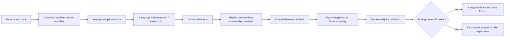
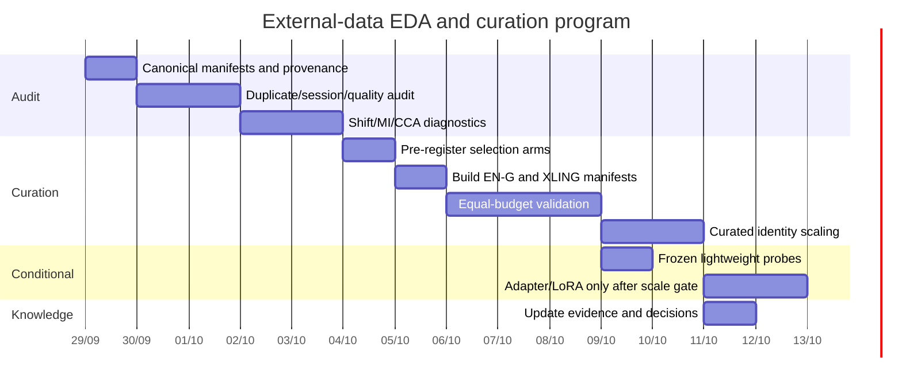

# FLAG External-Data EDA, Curation, and Lightweight Adaptation Research

[Download the complete Markdown report](sandbox:/mnt/data/FLAG_EDA_Curation_Lightweight_Adaptation_Research_2026-09-29.md)

## Executive summary

The evidence currently stored in Drive points to a different research priority from the earlier architecture-centric plans: **before acquiring or training on more external data, FourFusion should determine exactly which external identities, languages, sessions, recording conditions, and demographic/soft-attribute distributions transfer to FLAG.** The canonical Drive state is synchronized through experiment (75): SET-13 is the Evaluation configuration at 21.01 overall EER; ImageBind zero-shot is the strongest additional representation; SetProto, SWA, CCA-on-ImageBind, and linear ImageBind adaptation are closed; and the residual gain from MAV-Celeb v1/v2 in the production system is concentrated mainly in English gender-constrained evaluation. fileciteturn2file0 fileciteturn10file0

This means the next high-information question is not:

> “What larger model should we train?”

but:

\[
\boxed{
\text{Which external data actually contains complementary FLAG-relevant information?}
}
\]

There is strong reason to treat **identity diversity and independent-condition diversity** separately from raw row count. The v4 training set has 6,485 paired rows, but only 4,029 unique voice feature vectors; it contains 1,267 duplicate voice groups, some as large as 24 rows, and several speakers have extremely few unique voice samples. Therefore, nominal sample count substantially overstates effective acoustic sample size. fileciteturn3file0

The most useful external pool already available in the project is MAV-Celeb v1/v2. Official MAV-Celeb statistics report v1 with 70 celebrities, English/Urdu, 18,385 utterances and 91 hours; v2 has 84 celebrities, English/Hindi, 23,287 utterances and 109 hours. The current project harness already merges identities, removes two overlaps with v4, performs identity-disjoint external folds, and requires positive face/voice pairs from different videos. citeturn10view0 fileciteturn10file0

The most important property of v1/v2 is not simply that they add roughly 154 nominal celebrities. They contain **the same identities speaking two languages**. This gives a way to separate person information from language information that a dataset with one language per identity cannot provide. For FLAG, that makes v1/v2 particularly valuable for EDA even when naïvely training on all of them gives mixed gains.

The proposed research program is:



The main recommendation is to build **multiple task-oriented curated manifests rather than one universal dataset**:

| Curated set | Main objective |
|---|---|
| **FLAG-CURATED-EN-G** | Improve the residual g/English weakness using English v1/v2 identities matched to FLAG conditions |
| **FLAG-CURATED-XLING** | Preserve the same speakers across English↔Urdu/Hindi to learn language-invariant person information |
| **FLAG-CURATED-SHIFT** | Minimize distribution mismatch to v4 train while preserving identity/session diversity |
| **FLAG-CURATED-HARD** | Concentrate same-gender cross-modal hard negatives without eliminating random negatives |
| **ALL-EQUALBUDGET** | Mandatory random/source-balanced control |

The pretrained models should initially serve as **frozen measurement instruments**. VGGFace/BTC measure the current bridge domain, ArcFace checks identity integrity, FaRL measures soft facial semantics, wav2vec2 measures speech-domain/soft attributes, and ImageBind measures a strong pretrained image–audio geometry. Current evidence specifically argues against adapting ImageBind merely because adaptation is possible: its zero-shot representation works strongly, while the attempted linear/CCA adaptations did not. fileciteturn2file0

The practical decision rule is therefore:

\[
\boxed{
\text{EDA}
\rightarrow
\text{curation}
\rightarrow
\text{equal-budget validation}
\rightarrow
\text{scaling test}
\rightarrow
\text{only then PEFT}
}
\]

The older model-planning document remains useful as historical rationale, but it should not override the current `EXPERIMENT_LOG → DECISIONS → OPEN_DIRECTIONS` knowledge order. fileciteturn0file5

## Data inventory and audit scope

### Drive-present data

The project already has most of the expensive neural features needed for EDA. `OPEN_DIRECTIONS.md` records BTC features, production features, ImageBind/FaRL/age features, and full v1/v2 external features in the existing Kaggle outputs. This makes the first EDA phase largely CPU-bound; expensive backbone extraction should only be repeated for missing raw-media statistics or exact hardware reproducibility. fileciteturn10file0

| Dataset | Project status | Size | Languages | Paired? | License/status | Important FLAG bias |
|---|---|---:|---|---|---|---|
| **MAV-Celeb v4 train** | Target reference | 70 speakers, 6,485 pairs | English train | Yes | Challenge dataset; redistribution license should be recorded explicitly | Tiny identity count; 40M/30F; heavy voice duplication; v4 WAVs are 16 kHz mono. fileciteturn3file0 |
| **MAV-Celeb v1** | **Present** | 70 celebrities, 966 videos, 18,385 utterances, 91 h | English + Urdu | Yes | Official page provides raw/split access; precise redistribution terms remain an audit item | 43M/27F; 11,835 English vs 6,550 Urdu utterances; local data includes 44.1 kHz audio. citeturn10view0 fileciteturn3file0 |
| **MAV-Celeb v2** | **Present** | 84 celebrities, 1,214 videos, 23,287 utterances, 109 h | English + Hindi | Yes | License provenance should be captured before creating redistributed derivatives | 56M/28F; 9,974 English vs 13,313 Hindi utterances. citeturn10view0 |
| **MAV-Celeb v3** | Historical control; current raw presence should be rechecked | 58 celebrities, 428 videos, 3,812 utterances, 14.8 h | English + German | Yes | Same license open item | Much smaller and population/domain mismatched; project evidence already found negative transfer. citeturn10view0 fileciteturn2file0 |

MAV-Celeb itself is sourced from celebrity interviews, talk shows, and debates. Its visual data has pose, motion-blur, clutter, occlusion, lighting, and quality variation, while the speech contains chatter, music, overlap, and compression artifacts. citeturn11search6 These are not merely nuisances: they should become explicit columns in the audit manifest because a curation strategy may otherwise accidentally select by source/video quality rather than useful face–voice person information.

### Prospective sources

VoxCeleb should not yet be treated as “more of the same.” Its value needs to be predicted from the v1/v2 curation/scaling experiment first. The official VoxCeleb site describes more than 7,000 speakers overall, with in-the-wild speech and broad variation in accents, ethnicity, age, lighting, overlap, and background noise. VoxCeleb1 has 1,251 celebrities, while VoxCeleb2 has 6,112; the VoxCeleb2 development partition alone contains 5,994 speakers and 1,092,009 utterances. citeturn4search0turn4search1turn4search4

However, official VoxCeleb2 audio/video/URL distributions are no longer available from the official site, and the current page specifies CC BY-SA 4.0 for its metadata rather than presenting a simple current raw-media download license. citeturn4search1 Thus, any future X1/VoxCeleb experiment needs both **technical curation** and **data provenance/license auditing**.

Mozilla Common Voice is fundamentally different. It provides multilingual community speech datasets, and current releases shown on Mozilla's dataset pages are commonly listed as CC0-1.0. It does not supply the face pairing required to train a face↔voice identity bridge directly. citeturn11search0turn11search9 Its plausible FLAG roles are therefore speech-domain analysis, channel robustness, or pretraining/fine-tuning of a speech-side representation—not paired face–voice bridge supervision.

### Canonical manifest

Rather than physically copying data into a new dataset, create a **versioned selection manifest**:

```text
data_manifests/
├── source_inventory.parquet
├── mav_v1_manifest.parquet
├── mav_v2_manifest.parquet
├── mav_v3_manifest.parquet
├── flag_curated_en_g_v0.parquet
├── flag_curated_xling_v0.parquet
└── licenses/
    ├── mav_status.md
    ├── voxceleb_status.md
    └── commonvoice_status.md
```

Minimum row schema:

```text
source
speaker_global_id
source_speaker_id
language
gender_meta
video_id
utterance_id

face_path
audio_path
face_hash
audio_hash

sample_rate
codec
duration_s
vad_ratio
snr_proxy

face_quality
face_pose
audio_quality

age_pred
age_pred_conf

license_tag
split_eligibility
exclusion_reason
```

The first EDA output should resolve these open items:

- exact usable v1/v2 identity count after global-name merging and removal of the two known v4 overlaps;
- local raw-file counts versus official MAV totals;
- actual sample-rate/codec distribution of v2 and any retained v3;
- number of independent videos per speaker/language;
- exact-vs-near duplicate rates;
- reliability/source of age metadata;
- precise MAV usage/redistribution terms;
- whether any VoxCeleb/Common Voice artifacts actually exist elsewhere in Drive but are not currently represented by the project manifests.

## Statistical EDA and mathematical diagnostics

### Count independent information, not rows

For each speaker \(s\), compute:

\[
N_s^f,\qquad N_s^v,\qquad U_s^f,\qquad U_s^v,\qquad V_s
\]

where \(N\) is nominal count, \(U\) is unique-content count, and \(V_s\) is distinct video/session count.

The current v4 data makes this distinction mandatory: 6,485 nominal paired rows correspond to only 4,029 unique voice vectors, and some speakers have almost no independent acoustic diversity. fileciteturn3file0

For approximately exchangeable correlated observations, the set mean has variance

\[
\operatorname{Var}(\bar z_s)
=
\frac{\sigma_s^2}{m}
\left[1+(m-1)\rho_s\right].
\]

This gives an effective sample size

\[
\boxed{
m_{\mathrm{eff}}
=
\frac{m}{1+(m-1)\rho_s}
}
\]

so when duplicated clips make \(\rho_s\rightarrow1\),

\[
m_{\mathrm{eff}}\rightarrow1
\]

regardless of how many rows are copied from that content.

This metric should be computed approximately from within-speaker embedding correlations/session clusters. It is far more informative than `samples_per_speaker` for deciding whether an external celebrity adds new information.

### Per-speaker entropy

For language, session/video, channel, duration bin, or SNR bin:

\[
H_s(c)
=
-\frac{
\sum_k p_{s,k}\log p_{s,k}
}{
\log K
}.
\]

Also report

\[
K_{\mathrm{eff},s}
=
\exp\left(-\sum_k p_{s,k}\log p_{s,k}\right).
\]

Recommended speaker-level columns:

```text
n_rows
n_unique_face
n_unique_voice
n_videos
n_languages

H_language
H_video
H_channel
H_duration
H_snr

largest_video_fraction
duplicate_fraction
effective_voice_count
```

The useful notion of a “large speaker” should become:

> many independent videos/conditions,

not:

> many extracted frames.

### Audio audit

For each clip compute:

- duration;
- sample rate;
- mono/stereo channels;
- container and codec;
- clipping fraction;
- RMS;
- silence fraction;
- VAD speech ratio;
- speech/noise power;
- SNR proxy.

A reproducible lightweight SNR estimate is

\[
\widehat{\mathrm{SNR}}
=
10\log_{10}
\frac{
\max(P_{\text{speech}}-P_{\text{noise}},\epsilon)
}{
P_{\text{noise}}+\epsilon
}.
\]

The v1↔v4 sample-rate difference should be explicitly preserved as metadata because the project documents v4 as 16 kHz mono while v1 contains 44.1 kHz material. fileciteturn3file0

Do not merely resample everything and forget the original condition. The model can otherwise learn a hidden source cue that cannot exist at Evaluation.

### Face audit

For each image compute:

```text
width × height
detector confidence
face-box occupancy
blur proxy
brightness
contrast
yaw/pitch
ArcFace embedding
```

ArcFace is appropriate here for identity integrity and overlap detection because it explicitly optimizes highly discriminative face identity geometry through an additive angular margin. citeturn6search1

It should **not** become the assumed cross-modal bridge representation: FourFusion's own evidence already shows that stronger unimodal face-recognition geometry does not imply better face↔voice matching. fileciteturn2file0

### Distribution divergence

For categorical distributions use Jensen–Shannon divergence:

\[
JS(P,Q)
=
\frac12KL(P\|M)
+
\frac12KL(Q\|M),
\qquad
M=\frac{P+Q}{2}.
\]

Audit at least:

```text
language
gender
source
sample-rate
codec/channel bucket
age bin
duration bin
SNR bin
session-count bin
```

For continuous variables report both distributional and interpretable measures:

\[
W_1(P,Q),
\quad
KS(P,Q),
\quad
\Delta\text{median},
\quad
\Delta q_{10},
\quad
\Delta q_{90}.
\]

For multivariate frozen representations use two complementary tests.

**MMD** tests whether two distributions differ by comparing RKHS mean embeddings and supports distribution-free two-sample testing. citeturn7search0

**C2ST** turns the problem into source classification: if a held-out classifier can easily distinguish v4 from v1/v2, the source distributions remain separable. citeturn7search11

But C2ST needs a crucial FLAG-specific correction:

\[
\boxed{\text{split by speaker, not by row}}
\]

Otherwise it can “detect source” by recognizing identities seen during classifier training.

```python
X = frozen_features
domain = (source != "v4").astype(int)
groups = global_speaker_id

for train_idx, test_idx in GroupKFold(5).split(X, domain, groups):
    clf = LogisticRegression(max_iter=2000)
    clf.fit(X[train_idx], domain[train_idx])

    score = clf.predict_proba(X[test_idx])[:, 1]
    auc.append(
        roc_auc_score(domain[test_idx], score)
    )
```

Run the domain test separately on:

```text
quality metadata only
VGG features
BTC features
ArcFace features
FaRL features
ImageBind face
ImageBind audio
soft attributes
```

That decomposition can answer *why* a source differs.

For example:

```text
C2ST(VGG)       high
C2ST(BTC)       low
C2ST(quality)   low
```

would implicate visual-population shift rather than recording conditions.

### Mutual information and shortcut analysis

Let:

- \(Y\): identity,
- \(S\): source,
- \(L\): language,
- \(A\): soft attribute, such as age/voice pitch/etc.

Compute:

\[
I(A;Y),
\quad
I(A;S),
\quad
I(A;L),
\quad
I(A;Y\mid S).
\]

For comparability use:

\[
NMI(A;Y)=\frac{I(A;Y)}{H(Y)}.
\]

For continuous variables, k-nearest-neighbor MI estimators such as the Kraskov estimator are suitable; significance should be assessed against a speaker-block permutation null rather than ordinary row shuffling.

More importantly, compute:

\[
I(L;Y)
\qquad\text{and}\qquad
I(S;Y).
\]

When each identity appears in only one language/source, language or source may become statistically indistinguishable from identity. The bilingual structure of v1/v2 gives an unusual opportunity to reduce this confounding.

A useful audit table is:

| Variable | \(I(\cdot;Y)\) | \(I(\cdot;S)\) | \(I(\cdot;L)\) | Conditional identity MI |
|---|---:|---:|---:|---:|
| predicted age | | | | |
| gender metadata | | | | |
| SNR | | | | |
| duration | | | | |
| pitch/formant summary | | | | |
| FaRL PCA components | | | | |
| wav2vec PCA components | | | | |

A variable that predicts source strongly but identity only weakly after conditioning is a **domain shortcut**, not a reason to retain that data.

### CCA and DCCA as diagnostic instruments

DCCA learns nonlinear transformations of two views by maximizing regularized canonical correlation. citeturn12search5 But high correlation is not equivalent to recovering uniquely meaningful latent person factors.

Recent identifiability results make this caveat explicit: nonlinear CCA obtains affine or shared-subspace identifiability only under additional assumptions such as latent distributional structure, whitening, and spectral separation; unrestricted nonlinear unmixing remains ambiguous. citeturn12search0turn12search1

For EDA, therefore:

1. form independent speaker/session prototypes;
2. PCA separately inside the training split;
3. fit ridge CCA;
4. bootstrap **speakers**;
5. inspect canonical-correlation confidence intervals and subspace stability.

```python
for b in range(1000):
    ids = rng.choice(
        train_speakers,
        size=len(train_speakers),
        replace=True,
    )

    xf, xv = speaker_prototypes(ids)

    pf = fit_pca(xf, dim=32)
    pv = fit_pca(xv, dim=32)

    cca = RidgeCCA(k=8, reg=1e-3)
    cca.fit(pf, pv)

    rho[b] = cca.canonical_correlations_
```

Do not bootstrap individual rows: that would again over-count replicated videos/audio.

### Why covariance rank matters

For sample covariance, an effective-rank bound has the approximate form

\[
\mathbb E
\|\hat\Sigma-\Sigma\|
\asymp
\|\Sigma\|
\left(
\sqrt{\frac{r_{\mathrm{eff}}}{n}}
\vee
\frac{r_{\mathrm{eff}}}{n}
\right).
\]

Koltchinskii and Lounici establish this type of dependence on effective rank and sample size. citeturn5academia39

For FLAG the operational interpretation is more important than the asymptotic constant:

\[
\boxed{
n \approx \text{independent speakers/sessions},
\text{ not CSV rows}
}
\]

This is why a 128-dimensional covariance estimate from thousands of duplicated rows can still be less reliable than a 16–32 dimensional estimate built from genuinely independent people.

### Scaling law

For every curated dataset size \(N\), fit

\[
E(N)
=
E_\infty
+
aN^{-\alpha},
\qquad
a,\alpha>0.
\]

Fit it separately for:

```text
sample EER
person-prototype EER
production cluster EER
```

and bootstrap across identities.

The purpose is **not** to believe the extrapolated \(E_\infty\) literally. The important quantity is whether

\[
\frac{\partial E}{\partial N}<0
\]

remains stable at the largest observed \(N\).

Current project evidence says the raw identity-scaling gain is already diminishing around the final 100→161 step in the production system. fileciteturn2file0 Therefore, a curated dataset is especially interesting if it changes that slope.

## Curation pipelines

### Deterministic pre-filter

Every curation experiment should start from exactly the same canonical pool:

```text
normalize global identities
        ↓
remove v4 overlap
        ↓
remove uncertain identity merges
        ↓
validate face/audio files
        ↓
exact duplicate hashes
        ↓
near-duplicate grouping
        ↓
session/video grouping
        ↓
minimum independent support
        ↓
eligible speaker pool
```

A sensible initial eligibility requirement is:

```text
≥ 2 independent videos
≥ 2 unique voice segments
≥ 2 usable faces
```

For bilingual experiments, require usable data in both languages.

Every exclusion should keep an `exclusion_reason`; curation should be reversible.

### Language-balanced selection

The official language totals are already unbalanced: v1 favors English, while v2 favors Hindi. citeturn10view0 Therefore, global row sampling is wrong.

Use per-speaker quota:

\[
k_{s,\ell}
=
\min(K,n^{unique}_{s,\ell}).
\]

Compare two pre-registered variants:

**LANG-EQUAL**

\[
w_{\text{English}}
=
w_{\text{Urdu/Hindi}}
\]

within each speaker.

**LANG-TARGET**

English receives target-task weight, while non-English remains as a within-person invariance condition.

This asks a clean scientific question:

> Is multilingual variation useful because it belongs to the same people, or merely because it gives more training rows?

### Gender balancing

v4 has 40 male / 30 female identities; v1 has 43/27 and v2 56/28. fileciteturn3file0 citeturn10view0

Do not automatically impose 50/50.

Compare:

```text
G-TARGET
match v4 identity-level ratio

G-PARITY
50/50 identity-level control
```

For gender-constrained training, negative mining should occur **within gender**. The goal is not to let gender solve the task; it is to ensure both gender strata contain enough identities and sufficiently hard negatives.

### Age-stratified selection

Age is plausible shared information between face and voice, but any automatically predicted age is noisy.

Recommended procedure:

```text
sample-level age estimates
        ↓
aggregate by speaker × modality × video
        ↓
median speaker age
        +
within-speaker uncertainty
        ↓
v4-train quantile bins
        ↓
target-matched / equal-bin arms
```

Compare:

```text
AGE-NONE
AGE-TARGET
AGE-EQUAL
```

Exclude or downweight identities whose predicted age varies implausibly across sessions.

### Hard-negative mining

Use only training identities.

For identity \(i\):

\[
h(i)
=
\frac{1}{K}
\sum_{j\in\mathcal N_K(i),j\neq i}
S_{\text{cross}}(i,j).
\]

For g-specific experiments, restrict neighbors to the same gender.

Do not make the training set 100% hard negatives. Use

\[
p(j\mid i)
=
(1-\lambda)p_{\mathrm{uniform}}
+
\lambda p_{\mathrm{hard}},
\]

with a pre-registered \(\lambda\), for example 0.3–0.7.

The most important FLAG-specific rule is:

> **Do not use ArcFace alone to define cross-modal hardness.**

ArcFace can detect face identity duplication and mislabeled identities, but the project has already shown its geometry is not the desired cross-modal geometry. fileciteturn2file0

Hardness should come from a frozen face↔voice score such as current VGG/BTC or SET-13-compatible training-only representations.

### Target-matched selection

Let \(T\) be v4 **train**, not dev.

For speaker subset \(S\), minimize:

\[
J(S)
=
\lambda_{\mathrm{shift}}MMD(S,T)
+
\lambda_{\mathrm{cat}}
\sum_c JS(P_c^S,P_c^T)
+
\lambda_{\mathrm{dup}}R_{\mathrm{dup}}(S)
-
\lambda_{\mathrm{session}}D_{\mathrm{session}}(S)
-
\lambda_{\mathrm{id}}\log|S|.
\]

This explicitly trades off:

- domain match;
- categorical distribution match;
- duplicate rate;
- independent-session diversity;
- number of identities.

Simple greedy implementation:

```python
selected = []
remaining = candidate_speakers.copy()

while len(selected) < target_n:
    winner = None
    winner_obj = float("inf")

    for spk in remaining:
        trial = selected + [spk]

        if not constraints_ok(trial):
            continue

        obj = (
            w_mmd * mmd(trial, v4_train)
            + w_js * js_mismatch(trial, v4_train)
            + w_dup * duplicate_rate(trial)
            - w_session * session_diversity(trial)
            - w_cover * coverage(trial)
        )

        if obj < winner_obj:
            winner = spk
            winner_obj = obj

    selected.append(winner)
    remaining.remove(winner)
```

The algorithm itself is not the hypothesis. The scientific test is whether this manifest beats a **same-size, same-budget random/source-balanced manifest**.

### Recommended candidate datasets

| Manifest | Selection | Target |
|---|---|---|
| `ALL-EQUALBUDGET` | identity-uniform, row-capped | Null control |
| `FLAG-CURATED-EN-G` | English + v4-like covariates + same-gender hardness + session diversity | g/En |
| `FLAG-CURATED-XLING` | same bilingual identities, equal per-language/session support | unseen-language robustness |
| `FLAG-CURATED-SHIFT` | minimum MMD/C2ST shift under diversity constraints | transfer |
| `FLAG-CURATED-HARD` | controlled hard-negative coverage | person discrimination |
| `FLAG-CURATED-PARETO` | combination only after single-factor experiments | final external set |

This is preferable to immediately merging everything because the latest source says external-data benefit is **not uniform across cells**: production gain is clearest in English g, while Urdu does not show the same benefit. fileciteturn10file0

## Pretrained features, lightweight adaptation, and compute

### Backbones as EDA instruments

| Backbone | Best current role | Extraction | Suggested compact representation |
|---|---|---|---|
| **VGGFace fc7** | Main bridge-face domain measurement | existing 4096-D post-ReLU feature | PCA 32/64/256 |
| **ArcFace** | overlap, label integrity, clustering, face-hardness sanity check | normalized identity embedding | PCA 64/128 |
| **FaRL** | soft facial semantics / demographic-domain audit | CLS/pooled representation | PCA 32/64 |
| **BTC ECAPA** | main voice bridge domain | existing 192-D | raw standardized or PCA 32/64 |
| **wav2vec2** | acoustic/language/soft-attribute domain | masked mean pooling over hidden states | PCA 32/64 |
| **ImageBind** | strong pretrained image↔audio geometry | normalized frozen embeddings | raw score + PCA 32/64 for EDA |

VGGFace was developed as a face-recognition representation; FaRL was explicitly developed as a general visual-linguistic facial representation; wav2vec 2.0 learns self-supervised speech representations; and ImageBind jointly embeds image, audio, text, depth, thermal, and IMU modalities. citeturn6search0turn6academia48turn6search5turn8search0

For PCA:

\[
\boxed{
\text{fit only on training speakers}
}
\]

Never fit PCA, whitening, normalization statistics, or CCA on held-out identities.

### Adaptation ladder

| Technique | Status for FLAG now | Reason |
|---|---|---|
| Frozen zero-shot | **Active** | ImageBind establishes strong frozen evidence |
| Linear/domain probe | **Active as diagnostic** | Low variance; ideal for C2ST/attribute probes |
| Ridge CCA | **Diagnostic / existing VGG-BTC use** | Useful shared-rank measurement |
| CCA on ImageBind | **Closed** | Already negative |
| Shallow MLP | **Allowed inside existing bridge harness** | Small trainable capacity |
| Residual CCA | **Closed current regime** | Existing evidence does not support reopening |
| Bottleneck adapter | **Conditional** | Only after curated scaling stays positive |
| LoRA | **Conditional** | Same gate; ImageBind LoRA currently postponed |
| Full backbone fine-tuning | **Do not pursue now** | Identity count/capacity mismatch |

Adapter modules keep the backbone frozen and add a small task-specific parameter set. citeturn7search2 LoRA instead freezes pretrained weights and parameterizes weight updates with low-rank matrices. citeturn7search12

A backbone should only be unfrozen/adapted when all of these are satisfied:

\[
\boxed{
\begin{aligned}
&\text{curated data wins ≥4/5 folds}\\
&+\ \text{largest scaling step still improves}\\
&+\ \text{person/cluster improvement, not sample-only}\\
&+\ \text{equal optimization budget}\\
&+\ \text{clear residual error mechanism}
\end{aligned}
}
\]

That prevents “we now have an A100” from becoming a scientific justification for LoRA.

### A100 and Kaggle T4 reproducibility

NVIDIA specifies T4 with 16 GB GDDR6 and 65 FP16 TFLOPS; A100 provides 40/80 GB variants and substantially higher FP16/BF16 Tensor Core throughput. citeturn9search2turn8search1

Most current v1/v2 representations are already cached, so the table below should be regarded as a **re-extraction/reproduction budget**, not required work. fileciteturn10file0

| Workload | T4 | A100 | Approximate planning cost |
|---|---|---|---|
| Hash/metadata/VAD/SNR | CPU | CPU | I/O bound |
| VGGFace / ArcFace | FP16, batch ~64–256 | FP16/BF16, ~256–1024 | ~0.1–0.4 T4 GPU-h / 10k images |
| FaRL ViT-B | FP16, batch ~16–32 | BF16, ~64–128 | ~0.3–1.0 T4 GPU-h / 10k |
| ECAPA | FP16, duration-bucketed | BF16/FP16, larger bucket | ~0.3–1 h T4 / 10k × 10 s |
| wav2vec2-large | FP16, batch 1–4 | BF16, batch 8–32 | ~2–5 h T4 / 10k × 10 s; ~0.4–1.2 h A100 |
| ImageBind image | FP16, batch 4–8 | BF16/FP16, ~32–64 | ~0.5–1.5 h T4 / 10k |
| ImageBind audio | FP16, batch 2–4 | BF16/FP16, ~16–32 | ~1.5–4 h T4 / 10k × 10 s |
| PCA / MMD / C2ST / CCA | CPU FP32/64 | CPU FP32/64 | minutes–tens of minutes |
| Existing bridge | feature-level | feature-level | inexpensive; **fix steps** |
| LoRA/adapter | rank 4–8, accumulation | rank 4–8, larger batch | conditional only |

These are planning ranges, **not measured benchmarks**. The correct reproducibility method is to benchmark 200–500 samples on the actual notebook and extrapolate.

Hardware must change throughput rather than experiment semantics:

```yaml
precision:
  T4: fp16
  A100: bf16

statistics_precision: fp32

optimizer_steps: fixed
manifest: fixed
speaker_folds: fixed
seed_list: [1, 11, 21, 31, 41]

pca_fit: train_only
cca_compute: fp32
length_bucketing: deterministic
cudnn_benchmark: false
```

For a hardware port, save a common score vector and require extremely high score/rank agreement before considering the reproduction valid. This follows the project’s existing feature/pipeline parity discipline. fileciteturn2file0

## Evaluation, experiment matrix, timeline, and repository workflow

### Validation protocol

The current Drive protocol is already suitable for this research:

- v4: five speaker-disjoint splits, 40 train / 30 held out;
- v1/v2: five folds over merged identities;
- remove the two known v4 overlaps;
- positive face and voice must come from different videos;
- same candidate/control split;
- same optimizer-step count;
- primary decision metric: **person/cluster production EER**;
- sample EER: secondary diagnostic;
- CodaBench/dev: not the scientific model selector. fileciteturn10file0

For each split:

\[
\Delta_s
=
EER_{\mathrm{control},s}
-
EER_{\mathrm{candidate},s}.
\]

Report:

```text
Δ1 ... Δ5
mean
median
SD
wins / 5
speaker-bootstrap 95% CI
```

Retain the existing decision gate: a fitted candidate should generally improve by at least ~1 EER in ≥4/5 paired splits; a parameter-free modification can use the existing ~0.5-EER threshold, with other relevant cells not degrading by more than 0.5. fileciteturn10file0

Bootstrap identities, **not rows**.

Report all three levels:

\[
EER_{\text{sample}},
\qquad
EER_{\text{person}},
\qquad
EER_{\text{cluster-production}}.
\]

The third one remains the decision metric because that is how SET-13 is actually deployed. fileciteturn2file0

### Experiment matrix

| Experiment | Hypothesis | Data | Compute | Positive signal |
|---|---|---|---|---|
| **EDA-EXT-01** | Row count overstates real diversity | raw v1/v2 | CPU | large row→unique/session reductions identify speakers that need caps |
| **EDA-SHIFT-01** | Successful transfer correlates with domain match | v4/v1/v2/v3 frozen features | CPU | shift metrics explain why v1/v2 outperform v3 |
| **CUR-LANG-01** | Same-person bilingual balance improves invariance | bilingual v1/v2 | CPU feature training | Urdu/Hindi held-out improves without English regression |
| **CUR-ENGG-01** | A target-matched subset contains most residual English-g gain | v1/v2 English | CPU | curated set beats equal-size random set on g/En production |
| **CUR-HARD-01** | Same-gender hard negatives help g | v1/v2 | CPU | g person/cluster gain > ng gain without instability |
| **CUR-AGE-01** | Age coverage carries complementary person signal | age estimates + v1/v2 | CPU | age-stratified beats equal-size control |
| **CUR-PARETO-01** | Combined curation dominates individual heuristics | all EDA outputs | CPU | ≥4/5 production wins |
| **SCALE-CUR-01** | Curation restores useful identity-scaling slope | 25/50/75/100% curated IDs | CPU | final scaling step remains negative in EER |
| **LIGHT-PROBE-01** | frozen representations still contain residual cues | curated set + frozen features | CPU/T4 | linear/shallow probe generalizes to held-out IDs |
| **LIGHT-PEFT-01** | adaptation becomes worthwhile after curation | only if SCALE-CUR passes | T4/A100 | LoRA/adapter beats frozen same-data control |

No EER gains should be forecast for these experiments. Their purpose is to resolve mechanisms.

### Visualizations to generate automatically

```text
speaker_unique_counts.png
language_by_speaker_heatmap.png
session_entropy_hist.png
duration_by_source.png
snr_by_source_language.png
gender_age_coverage.png
c2st_auc_matrix.png
mmd_matrix.png
cca_spectrum_bootstrap.png
snr_vs_error.png
subset_shift_vs_delta_eer.png
identity_scaling_curve.png
```

The two highest-value figures are likely:

\[
\boxed{
\text{language × identity heatmap}
}
\]

because it reveals confounding, and

\[
\boxed{
EER(N)\text{ for curated vs random identities}
}
\]

because it tells us whether downloading VoxCeleb is justified.

### Research timeline



### Source/repository update

Preserve the current source-of-truth order:

\[
\boxed{
\texttt{EXPERIMENT\_LOG.md}
\rightarrow
\texttt{DECISIONS.md}
\rightarrow
\text{plans/research}
}
\]

as already stated by the current Drive decisions. fileciteturn2file0

Recommended experiment tree:

```text
Experiment/EDA-EXT-01/
├── README.md
├── config.yaml
├── build_manifest.py
├── audit.py
├── curate.py
├── validate.py
├── manifests/
├── tables/
├── figures/
└── results.csv
```

Recommended notebooks:

```text
FLAG_15_EXT_EDA.ipynb
  discover sources
  build canonical manifest
  duplicates / integrity
  audio / visual quality
  demographic / language / session statistics
  shift tests
  MI / confounding
  CCA bootstrap
  export audit

FLAG_16_EXT_CURATE.ipynb
  load frozen audit
  preregister arms
  language balancing
  gender / age stratification
  hard-negative selection
  target-matched selection
  export immutable manifests

FLAG_17_EXT_VALIDATE.ipynb
  load fixed folds
  equal-budget controls
  existing bridge training
  sample / person / cluster EER
  paired statistics
  identity scaling
  A100/T4 parity
  export results
```

Every resulting dataset should be addressed by its manifest hash:

```markdown
### (XX) CUR-EXT — 2026-__-__

Question:
Does FLAG-CURATED-EN-G improve production g/English?

Manifest:
flag_curated_en_g_v0.parquet

Manifest SHA256:
...

Sources:
MAV-Celeb v1 ...
MAV-Celeb v2 ...

License provenance:
...

Identity normalization:
...

Overlap policy:
two v4 overlaps removed

Validation:
five paired v4 splits
five external identity folds

Optimization:
same steps / same seeds / same sampler budget

Primary:
person/cluster production EER

| arm | IDs | unique voice | videos | g/En | ng/En | Urdu-g | Hindi-g | wins/5 |
|---|---:|---:|---:|---:|---:|---:|---:|---:|
| random control | | | | | | | | |
| curated | | | | | | | | |

Paired bootstrap CI:
...

Decision:
PROMOTE / REJECT / INCONCLUSIVE
```

`DECISIONS.md` should store only the scientific conclusion:

```markdown
CLAIM DATA-CUR-001

Statement:
Target-matched v1/v2 curation improves
g/English production generalization.

Status:
ACTIVE / CLOSED / REVERSED / PENDING

Evidence:
EXPERIMENT_LOG (XX)
manifest SHA256 ...

Counter-evidence:
...

Scope:
SET-13 production
speaker-disjoint validation
equal optimization budget

Confidence:
high / medium / low

Reopen condition:
...

Last updated:
2026-__-__
```

The key principle is:

\[
\boxed{
\text{EDA does not validate a dataset.}
}
\]

EDA identifies plausible data mechanisms and permits **pre-registration** of curation rules. The causal test remains held-out identity performance.

Accordingly, the most defensible path toward a new FLAG-specific external dataset is:

\[
\boxed{
\text{raw external pool}
\rightarrow
\text{speaker/session audit}
\rightarrow
\text{confounding + shift analysis}
\rightarrow
\text{versioned curated manifests}
\rightarrow
\text{equal-budget bridge training}
\rightarrow
\text{production person/cluster EER}
\rightarrow
\text{identity scaling}
}
\]

Only if that final scaling curve remains favorable should the project spend effort on larger sources such as VoxCeleb or reopen parameter-efficient adaptation such as adapters/LoRA. This preserves the best lesson from the existing experiments: **new capacity should follow evidence that the data can support it, rather than being used as a substitute for understanding the data.**