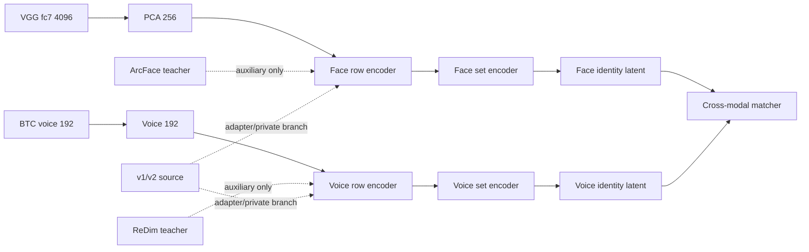
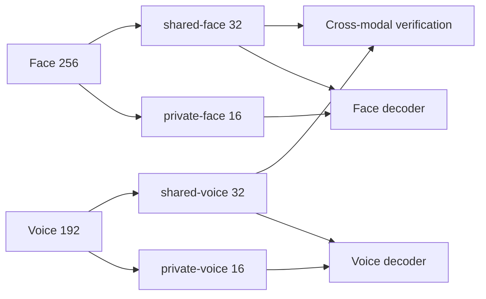
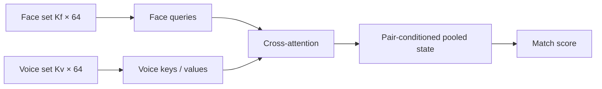
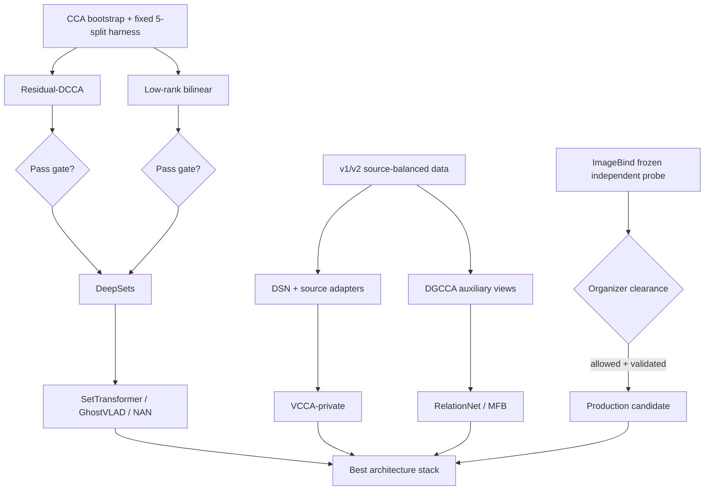

# FourFusion_FLAG2027: Architecture Research Plan for Driving g/English Toward 19 EER

> **Lịch sử (27–28/09, mốc SET-02 21.68, g/En 28.31). g/En nay là 23.22 nhờ ImageBind (SET-13). Các đề xuất kiến trúc (bilinear, cross-attention, set aggregator, adapter nguồn …) vẫn đóng theo ARCH-01; SetProto × thêm người đã được kiểm chứng: ≈ 0 (74).** Trạng thái hiện hành (29/09, nhật ký tới mục 75): cấu hình Evaluation là **SET-13 (CB 21.01) qua `BEST/v6_eval`**; xem [DECISIONS.md](DECISIONS.md) và [OPEN_DIRECTIONS.md](OPEN_DIRECTIONS.md).

## Executive assessment

The new evidence makes the research problem much narrower than it looked a few days ago. **FourFusion is no longer primarily bottlenecked by unimodal recognition or by test-time clustering. It is bottlenecked by how identity-level information shared between face and voice is represented, generalized to unseen people, and compared after aggregation.**

The current production point is SET-02 at **21.68 overall**, with **g/English = 28.31**, while the project’s September 26 leaderboard snapshot contained a 19.35 g/English system. SET-02’s gain came overwhelmingly from cluster/set aggregation; subsequent clustering changes have yielded little, and the internally measured gap to true-identity aggregation is now below roughly one EER in the relevant clustering experiments. fileciteturn0file0 fileciteturn0file4

The strongest evidence for where to spend the next experiments is:

| Evidence | What it says |
|---|---|
| ArcFace face EER ≈1.7 but cross-modal ≈33.9 vs VGG ≈26.2 | Better face recognition geometry is not the bridge geometry we need. fileciteturn0file4 |
| ReDimNet improves speaker recognition to ≈3.17 EER but does not improve the bridge | Voice encoder quality is also no longer the primary bottleneck. fileciteturn0file4 |
| SET-02: 28.69 → 21.68 overall | Identity/set aggregation is fundamental. fileciteturn0file0 |
| Oracle/true-identity aggregation is only about 22.75 gender EER on held-out experiments | Even perfect grouping leaves a substantial bridge error. This number is from a different held-out protocol and should not be numerically equated with dev g/En, but it identifies the remaining bottleneck. fileciteturn0file4 |
| EXT-03 `v1+v2+SetProto` improves held-out v4 cluster EER by about 2.83 gender EER on average, while also improving Urdu/Hindi transfer | More identities plus identity-level training can move the bridge by multiple EER, although the gender win count was only 3/5 and therefore does not yet pass the strict promotion rule. fileciteturn0file2 |
| SetProto alone is much smaller: about +0.33 mean gender gain on the five-split run | The important interaction appears to be **SetProto × more identities**, not SetProto by itself. fileciteturn0file2 |
| Frozen ImageBind stream reportedly improves independent validation by roughly 5.5–8 EER, but legality is unresolved | This is currently the largest architecture signal and warrants a rigorous independent replication, but not a competition submission until organizers clarify the rule. fileciteturn0file0 |

A useful picture of the target is:

```text
g/English EER

SET-02 dev                 28.31  ████████████████████████████
                                            │
                         ~9.3 EER target gap │
                                            ▼
Target                      19.0  ███████████████████

26-Sep leaderboard ref      19.35 ███████████████████
```

The important implication is that **28.31 → 19 is unlikely to come from one new MLP head**. The plausible route is a combination of:

\[
\boxed{
\text{better shared latent}
+
\text{identity-level training}
+
\text{better cross-modal metric}
+
\text{controlled external identities}
}
\]

with a second, potentially much larger path through a legally permitted pretrained joint image–audio representation.

The six experiments I would run first are:

| Order | Experiment | Core question | Expected information gain |
|---|---|---|---|
| **A** | **ARCH-RDCCA** | Is the stable face↔voice signal a small nonlinear correction to the already-strong CCA subspace? | Very high |
| **B** | **ARCH-BILINEAR** | Is cosine itself limiting person-level discrimination? | Very high / very cheap |
| **C** | **ARCH-DEEPSET** | Does learning the identity set representation, rather than averaging row embeddings, improve unseen identities? | High |
| **D** | **ARCH-DSN** | Can shared/private decomposition use v1/v2 without importing source/language nuisance? | Very high |
| **E** | **ARCH-DGCCA** | Can ArcFace/ReDim recognition geometry help as privileged auxiliary views without becoming the bridge? | High |
| **F** | **ARCH-IMAGEBIND-PROBE** | Does the very large frozen-ImageBind validation gain survive five paired splits and independent VAL-70? | Extremely high, compliance-dependent |

The core recommendation is therefore **not “try larger architectures.”** It is to constrain every architecture around the actual statistical regime: low identity count, frozen features, unseen identities, set-level inference, and source/language shift.

## Evaluation protocol and diagnostic stack

The evaluation harness is as important as the architecture because the existing logs already demonstrate that one-seed results and the current dev leaderboard cannot resolve changes around one EER reliably. Seed changes alone moved dev by roughly 0.65–1.32 EER in recent checks, and SET-02 was selected on that same development set. fileciteturn0file0

### Exact outer evaluation protocol

Every architecture should use the **same five pre-generated speaker-disjoint splits and the same trials**.

For each outer split:

```text
v4 identities
    │
    ├── train identities
    │      └── all training / fitting / CCA / PCA / scaler
    │
    └── held-out identities
           ├── sample-level evaluation
           ├── true-identity set/prototype evaluation
           └── estimated-cluster production evaluation
```

All transforms must be fit inside the split:

```text
StandardScaler
PCA
CCA
DCCA initialization
source statistics
set model
matcher
SWA/SWAD checkpoints
```

No held-out identity is allowed to participate in any of these operations.

The held-out evaluation should report three levels:

| Level | Purpose |
|---|---|
| **Sample EER** | Detect whether raw embeddings improved. |
| **True-prototype EER** | Primary architecture diagnostic: removes clustering quality from the question. |
| **Estimated-cluster EER** | Closest simulation of SET-02 production inference. |

For every level, generate both protocols:

\[
\text{ng}: \text{unconstrained negatives}
\]

\[
\text{g}: \text{same-gender negatives}
\]

The latter is the most important architecture target because FLAG explicitly uses a gender-constrained condition to prevent gender from solving the association task; the official evaluation also separates heard/unheard languages and unseen identities. citeturn12academia29

### External-language evaluation

v1 and v2 are unusually valuable because they provide **true bilingual identities**, not pseudo-labels. The current external experiments already show that `v1+v2+SetProto` can improve v4 and unseen-language proxies, but the source effect is nontrivial. fileciteturn0file2

Use two complementary tests.

**Within-source transfer**

```text
v1:
train IDs: English
held-out IDs:
    same face pool + English voice → heard
    same face pool + Urdu voice   → unheard

v2:
train IDs: English
held-out IDs:
    same face pool + English voice → heard
    same face pool + Hindi voice   → unheard
```

The face pool, identities and trial-generation rule must be identical between heard and unheard. Only voice language changes.

**Cross-non-English transfer**

```text
train:
v4 English
+ v1 English/Urdu
+ v2 English

evaluate:
held-out v2 Hindi
```

and the reverse:

```text
train:
v4 English
+ v2 English/Hindi
+ v1 English

evaluate:
held-out v1 Urdu
```

This determines whether a model learns transferable speaker structure rather than merely becoming good at a particular external source.

### Diagnostics required for every architecture

The following diagnostics should be emitted into the result CSV, not treated as optional EDA.

| Diagnostic | Exact measurement | Interpretation |
|---|---|---|
| **CCA spectrum** | Canonical correlations \(\rho_1,\ldots,\rho_k\) | How many cross-modal directions are actually supported? |
| **CCA bootstrap stability** | Speaker-bootstrap CCA; principal angles between bootstrapped subspaces | Is a direction repeatable across identities or merely fit noise? |
| **Effective rank** | \(r_\mathrm{eff}=\exp[-\sum p_i\log p_i]\), \(p_i=\lambda_i/\sum\lambda\) | Detect low-dimensional collapse. |
| **Participation ratio** | \((\sum\lambda_i)^2/\sum\lambda_i^2\) | Second rank estimate. |
| **Alignment** | Mean positive \( \|z_f-z_v\|^2 \) | Are same identities actually closer? |
| **Uniformity** | \(\log E[e^{-2\|z_i-z_j\|^2}]\) within each modality | Is the hypersphere occupied sensibly? |
| **Hubness** | \(N_k\) skewness, Gini, max \(N_k\), top-5%-hub mass | Are a few voices/faces attracting many wrong identities? |
| **Mutual-kNN** | fraction of reciprocal face↔voice nearest neighbors | Detect asymmetric hubs. |
| **Teacher overlap** | Jaccard@5 / rank overlap with ArcFace and ReDim neighborhoods | Did the shared representation retain useful identity structure? |
| **Prototype EER** | true-identity mean/set representation | Separates representation error from cluster error. |
| **Per-identity error** | miss/false-match rate per held-out identity | Detect the concentrated failures seen in ERR-01. |

Alignment and uniformity are theoretically motivated diagnostics for normalized contrastive representations; Wang and Isola showed they capture two core geometric properties of contrastive embeddings. citeturn13search0

Hubness deserves explicit measurement because cross-modal joint embeddings can develop “hub” gallery points that become nearest neighbors of many queries. Querybank Normalisation showed this systematically in cross-modal retrieval and proposed normalization schemes that do not require retraining. citeturn8search4 FourFusion has already observed voice hubs qualitatively, although CSLS did not survive fusion, so **hubness is first a diagnostic and only later a score-correction target**. fileciteturn0file4

### Statistics and promotion

Define paired improvement as:

\[
\Delta_{s,c}
=
EER_{\text{baseline},s,c}
-
EER_{\text{candidate},s,c}
\]

so positive values are improvements.

Report:

```text
Δ split 1 ... split 5
mean Δ
median Δ
std Δ
wins / 5
identity-bootstrap CI of paired Δ
```

A candidate is promoted when either:

\[
\boxed{
\text{wins}\ge4/5
\;\land\;
\overline{\Delta}\ge1.0\text{ EER}
}
\]

on the primary target, **or** it shows consistent cross-language improvement on both Urdu/Hindi proxies without a material English regression.

For an architecture targeting g/English specifically, the preferred gate is:

```text
primary:
    g/En true-prototype: wins >= 4/5, mean gain >= 1.0

secondary:
    g/En estimated-cluster: same direction
    ng/En: regression <= 0.5
    Urdu/Hindi: no systematic regression

after promotion only:
    run four-cell dev sanity check
```

That avoids repeating the winner’s-curse problem documented in the current project decisions. fileciteturn0file0

## Architecture designs

The common input should remain deliberately conservative:

```text
Face
VGGFace fc7 4096
      ↓
split-fit StandardScaler
      ↓
PCA-256
      ↓
xf ∈ R^256

Voice
BTC ECAPA
192-d
      ↓
split-fit StandardScaler
      ↓
xv ∈ R^192
```

VGG/BTC remain the **primary bridge views** because the logs show that ArcFace/ReDim are superior recognizers but inferior cross-modal bridge features. fileciteturn0file0

The global design should look like this:



**Residual-DCCA.** DCCA learns nonlinear functions of two views whose outputs maximize regularized canonical correlation. The original DCCA formulation is particularly relevant because CCA is already one of FourFusion’s strongest low-data inductive biases; DCCAE later showed that combining canonical correlation with reconstruction could outperform several alternative deep multi-view representations. citeturn8search2turn8search11

Do **not** repeat the previous generic residual-CCA architecture sweep. The new experiment should specifically be a **CCA-initialized, low-rank nonlinear residual with an explicit DCCA objective and SetProto**, preferably with v1/v2 identities available. The earlier residual head was negative in the 70-person regime, so this variant is justified only by the new training regime and explicit correlation regularization. fileciteturn0file0

Use:

\[
z_f =
\operatorname{norm}
(W_f^{CCA}x_f + \alpha R_f(x_f))
\]

\[
z_v =
\operatorname{norm}
(W_v^{CCA}x_v + \alpha R_v(x_v))
\]

with:

```text
R_f: 256 → 64 → k
R_v: 192 → 64 → k
k: 16, 32
alpha initial: 0.00 or 0.05
```

Initialize the final residual layers to zero so epoch zero reproduces the CCA solution exactly.

Loss:

\[
L =
L_{MP}
+\lambda_pL_{SetProto}
+\lambda_cL_{DCCA}.
\]

Sweep only:

```yaml
k: [16, 32]
lambda_proto: [0.25, 0.5]
lambda_corr: [0.05, 0.10, 0.25]
alpha_init: [0.0, 0.05]
```

An important numerical constraint: DCCA estimates covariance inside a batch. With \(P\) identity prototypes in an episode, choosing \(k\approx P\) makes covariance estimation unstable. On v4-only training, use `P>=24, k=16`; only test `k=32` when external identities permit `P>=48`. Compute the DCCA covariance/SVD in FP32 even if the rest of training uses mixed precision, with an eigenvalue floor around \(10^{-4}\).

**VCCA-private / DSN.** VCCA-private explicitly introduces common variables and view-specific private variables; DSN similarly divides representation into shared and private subspaces and adds reconstruction so that domain-specific information need not contaminate the shared representation. citeturn9academia36turn13academia36

For FourFusion:



Start with **deterministic DSN**, not VCCA, because it is easier to diagnose.

Proposed encoders:

```text
shared face : 256 → 128 → 32
shared voice: 192 → 128 → 32

private face : 256 → 128 → 16
private voice: 192 → 128 → 16
```

Decoders receive `[shared, private]`.

Loss:

\[
L =
L_{MP}
+\lambda_pL_{SetProto}
+\lambda_rL_{recon}
+\lambda_oL_{orth}.
\]

with

\[
L_{orth} =
\|Z_s^\top Z_p\|_F^2.
\]

Sweep:

```yaml
shared_dim: [16, 32]
private_dim: [8, 16]
lambda_recon: [0.02, 0.10]
lambda_orth: [0.01, 0.05]
```

The hypothesis is particularly strong for external data: Urdu/Hindi/source/channel information can live in private components while transferable person structure remains in the shared branch.

VCCA-private is the second-stage variant:

```text
shared μ/logσ²: 32
private μ/logσ²: 16
beta_KL: 1e-4, 1e-3, 1e-2
KL warmup: first 25% of training
```

Its major risk is **non-identifiability**: there is no guarantee that language goes private and useful identity goes shared. Therefore every run must probe shared/private latents for source, language, gender and identity predictability. VCCA-private’s source paper explicitly frames it as extraction of common and private variables but does not guarantee a semantically unique disentanglement. citeturn9academia36

**DGCCA with privileged recognizer views.** DGCCA generalizes nonlinear CCA to arbitrarily many views. citeturn9search5 This provides the cleanest way to exploit ArcFace and ReDimNet **without turning either into the verification embedding**.

Training views:

```text
primary:
    VGG-PCA256
    BTC192

privileged/auxiliary:
    ArcFace512 → PCA128
    ReDimNet   → PCA128
```

Each maps to a common \(G\in\mathbb R^{16/32}\):

```text
VGG256     → 64 → G
BTC192     → 64 → G
ArcFace128 → 64 → G
ReDim128   → 64 → G
```

Inference uses only:

```text
VGG → G
BTC → G
```

Auxiliary views disappear.

Use low auxiliary weights:

```yaml
common_dim: [16, 32]
aux_weight: [0.10, 0.25]
lambda_dgcca: [0.05, 0.10]
```

The reason not to weight all four views equally is empirical: the project already established that ArcFace/ReDim geometry is excellent for recognition and bad for the cross-modal bridge. Equal DGCCA weighting could force BTC/VGG to imitate the wrong geometry. fileciteturn0file4

A safer alternate auxiliary term is similarity-preserving KD, which transfers pairwise relations without requiring the student to copy the teacher’s coordinates. citeturn13search1 But this should remain an ablation behind DGCCA because teacher geometry is not proven beneficial for face↔voice matching.

**Low-rank bilinear matcher and MFB.** Current systems ultimately depend heavily on projected cosine similarity. That assumes the two towers first rotate information into matching coordinates:

\[
s=\sum_i z^f_i z^v_i.
\]

A bilinear score allows:

\[
s(x_f,x_v)=z_f^\top Mz_v.
\]

Use:

\[
M=UV^\top
\]

so

\[
s=(U^\top z_f)^\top(V^\top z_v).
\]

Start from the existing 128-d row/prototype embeddings to isolate the **matcher** from representation learning:

```text
face prototype 128 → U → r
                         dot → score
voice prototype 128 → V → r

r = 8 / 16 / 32
```

At rank 16 this adds only about **4.1k parameters**.

Bilinear/multiplicative multimodal interactions are substantially more expressive than plain linear fusion, while low-rank formulations keep their parameter and computational cost small. MFB factorizes bilinear pooling, and Low-rank Multimodal Fusion similarly uses low-rank factors to avoid the dimensional explosion of full tensor fusion. Their published gains are in other multimodal tasks, so they provide a mechanism—not direct evidence of FLAG gains. citeturn10search1turn8search1

If bilinear wins, test MFB:

```text
zf128 → U → (d × factor)
zv128 → V → (d × factor)
               ↓
       elementwise multiply
               ↓
       sum over factor
               ↓
     signed-sqrt + L2
               ↓
             score
```

Use:

```yaml
d: [32, 64]
factor: [3, 5]
```

Do not open the full MFB sweep unless low-rank bilinear first gives a repeatable paired gain.

**RelationNet.** Relation Networks learn a comparison function episodically and were explicitly designed to transfer a learned metric to unseen classes. citeturn10search0 That matches FLAG’s unseen-identity requirement better than a classifier head.

At person level:

\[
r=
[z_f,z_v,|z_f-z_v|,z_f\odot z_v]
\]

For 128-d prototypes:

```text
512 → 128 → 32 → 1
```

about 70k parameters.

Train on complete episode score matrices, not isolated pairs:

```text
P face prototypes × P voice prototypes
                ↓
        RelationNet score matrix
                ↓
symmetric identity cross-entropy
```

Do not tune its threshold on dev; EER is computed from its raw monotonic relation score.

**DeepSets.** Deep Sets provides the canonical permutation-invariant form

\[
A(X)=\rho\left(\sum_{x\in X}\phi(x)\right),
\]

making it a natural replacement for arithmetic averaging of cluster members. citeturn9search9

Use the current row tower first:

```text
row embedding 128
       ↓
φ: 128 → 64 → 64
       ↓
mean over K
       ↓
ρ: 64 → 64
       ↓
L2 normalize
```

Do this independently for face and voice.

This is the first set architecture to try because it directly addresses the train/inference mismatch without attention complexity. But its expected v4-only gain should be modest: SetProto alone already showed only a small gender improvement, and clustering itself is close to saturated. Its best chance is **DeepSets + v1/v2 + P×K episodic training**, not DeepSets on 40 training identities. fileciteturn0file2

**NAN.** Neural Aggregation Network learns permutation-invariant attention over a face/image set and was shown to emphasize informative inputs and downweight poorer ones without explicit quality supervision. citeturn11search5 Adapt it symmetrically:

\[
q_i = h(z_i),
\quad
a_i=\operatorname{softmax}(q_i),
\quad
p=\sum_i a_i z_i.
\]

Proposed head per modality:

```text
128 → 32 → 1
```

No quality-label loss initially.

**GhostVLAD.** GhostVLAD learns a compact set descriptor and introduces “ghost” clusters that receive inputs but do not contribute to the final aggregate, allowing poor-quality observations to be suppressed. citeturn11academia46

Proposed FourFusion configuration:

```yaml
input_dim: 64
real_clusters: [4, 8]
ghost_clusters: [1, 2]
output_dim: 64
```

Its limitation is important: a high-quality sample belonging to the **wrong identity** is not necessarily “poor quality,” so GhostVLAD is more likely to solve quality contamination than true over-merging.

**Set Transformer.** Set Transformer adds pairwise interaction between set members while retaining permutation invariance; its induced-attention formulation can reduce self-attention complexity when sets grow. citeturn9search0

Keep it tiny:

```text
128 → d=64
1 × SAB
2 heads
FFN hidden 128
1 PMA seed
→ 64-d identity embedding
```

Sweep only:

```yaml
heads: [2, 4]
dropout: [0.0, 0.1]
```

Do not make depth a hyperparameter. The main risk is overfitting 40–70 identities.

**Cross-attention set-to-set.** This is more radical: do not compress each identity cluster independently before matching.



Use a second symmetric direction voice→face and average scores.

Configuration:

```yaml
d_model: 64
heads: 2
blocks: 1
K_face_cap: 8
K_voice_cap: 8
```

This architecture can answer a question that independent prototypes cannot:

> Which voice observations are most relevant for **this particular face set**?

Its disadvantage is \(O(K_fK_v)\) work per cluster pair and much higher capacity. It belongs after a simpler DeepSets/NAN model demonstrates that learnable set aggregation has signal.

**Source adapters.** External v1/v2 data already demonstrates both useful transfer and negative-transfer risk. fileciteturn0file0 A source adapter is a cheap way to allow source-specific nuisance without allocating an entirely different bridge.

For a hidden state \(h\in\mathbb R^{128}\):

\[
h'=h+W_2\sigma(W_1h)
\]

with:

```text
128 → 16 → 128
```

Create separate residual adapters for:

```text
v4
v1
v2
```

while sharing the main bridge.

At FLAG inference select the v4 adapter. The adapter bottleneck adds only around 4.2k parameters per adapter.

Compare:

```text
shared-only
shared + source adapters
DSN shared/private
```

on exactly the same source-balanced episodes.

**Mixture of Experts.** A train-only MoE may discover complementary cross-modal mappings, but it has the highest shortcut risk: the gate can simply become a source or language detector.

Use at most three small experts:

```text
shared stem
   ├── expert A → 64
   ├── expert B → 64
   └── expert C → 64

gate → softmax 3
```

Include:

\[
L_{balance}
\]

to prevent expert collapse.

Compare learned-gate inference with a **fixed equal-expert average**. If the learned gate only wins in seen source/language and loses Hindi/Urdu transfer, reject it.

**ImageBind frozen probe.** ImageBind is qualitatively different from every architecture above because it was pretrained into a joint image/audio space; the original work binds six modalities into one embedding space using image-paired data. citeturn10academia36 The official implementation is released under a non-commercial Creative Commons license. citeturn12search0

The FourFusion logs currently report by far the largest validation signal from this stream—approximately **5.5–8 EER**—but that needs an especially strict replication because such a large gain would change the entire architecture roadmap. fileciteturn0file0

Run:

```text
raw image ── ImageBind vision ── 768
                                     cosine
raw audio ── ImageBind audio  ── 768
```

and four predeclared variants only:

```text
IB-0: raw frozen cosine
IB-1: train-only CCA-16 on ImageBind face/audio
IB-2: frozen ImageBind score + SET-02 fixed rank fusion
IB-3: concatenate small ImageBind PCA-32 auxiliary stream to VGG/BTC bridge
```

No LoRA, no backbone fine-tuning.

The external precedent is meaningful but not decisive: the FAME 2026 second-place system used ImageBind with LoRA and external Arabic VoxBlink data and reported 24.73 evaluation EER across English/German. citeturn14academia22 That does **not** establish a frozen ImageBind identity signal or compliance under FLAG 2027.

## Architecture comparison

Parameter counts below refer to the **proposed FourFusion trainable additions**, excluding frozen VGG/BTC and other frozen teacher encoders. Expected g/En benefit is a research prior for prioritization, not a forecast.

| Architecture | Proposed dims | Added trainable params | Inference cost | Overfit risk | Frozen-feature compatible | g/En prior |
|---|---:|---:|---|---|---|---|
| **Residual-DCCA** | 256/192 → residual64 → 16/32 | ~31–33k | Very low | Low–medium | **Yes** | **0.5–2 EER** |
| **Low-rank bilinear** | 128×128, rank 8–32 | ~2–8k | Negligible | **Low** | **Yes** | **0.5–1.5** |
| **MFB** | 128×128 → d32/64, factor3/5 | ~25–82k | Low | Medium | **Yes** | 0.5–1.5 |
| **RelationNet** | pair512 → 128 → 32 →1 | ~70k | Low | Medium–high | **Yes** | 0.5–1.5 |
| **DeepSets** | row128 → φ64 → ρ64 | ~33k | Low | Low–medium | **Yes** | **0.5–2**, more likely with v1/v2 |
| **NAN** | attention 128→32→1 | ~8k | Very low | Low–medium | **Yes** | 0–1 |
| **GhostVLAD** | d64, K=4/8, ghost=1/2 | ~40–70k | Low | Medium | **Yes** | 0–1 |
| **Set Transformer** | d64, 1 SAB, 2 heads, PMA | ~0.1–0.15M | Medium | **High** | **Yes** | 0.5–2 |
| **Cross-attention set-to-set** | d64, 1 bidirectional block | ~0.08–0.15M | **High** | **High** | **Yes** | 1–2.5 if set signal exists |
| **DSN** | shared32 + private16 | ~0.20M | Low | Medium | **Yes** | **1–3 with v1/v2** |
| **VCCA-private** | shared32 + private16 stochastic | ~0.2–0.3M | Low | **High** | **Yes** | 0.5–2.5 |
| **DGCCA** | four views → G16/32 | ~50–60k | Low at test | Medium | **Yes** | **0.5–2** |
| **Source adapters** | 128→16→128/source | ~25k total for 2 modalities×3 sources | Negligible | Low–medium | **Yes** | **1–3 if negative transfer dominates** |
| **MoE** | 3 small experts | ~0.1–0.25M | Medium | **Very high** | **Yes** | 0–2 |
| **ImageBind frozen** | 768 image/audio | 0 head params for raw probe | **High backbone cost** | Low statistical / high compliance | Requires raw media | **Measured internal signal 5.5–8 EER; unverified** |

The order matters. There is little reason to deploy a Set Transformer before testing DeepSets; little reason to deploy MFB before low-rank bilinear; and little reason to use VCCA before a deterministic DSN establishes that shared/private decomposition works at all.

## Prioritized experiment queue

The queue below is designed around **information gained per unit compute**, not novelty.

| Priority | ID | Experiment | Compute estimate with cached features | Main hypothesis | Promotion |
|---|---|---|---|---|---|
| **P0** | **ARCH-RDCCA** | CCA bootstrap + CCA-init residual-DCCA | ~1–2× current five-split MLP budget | Shared signal is stable and low-rank | g/En ≥4/5 wins, mean ≥1 |
| **P0** | **ARCH-BIL** | Low-rank bilinear prototype matcher | **<1×** | Cosine is leaving cross-coordinate information unused | Same |
| **P0** | **ARCH-DEEPSET** | DeepSets + P×K + row loss + SetProto | ~1.5× | Train/test granularity mismatch matters | Prototype + cluster gain |
| **P0** | **ARCH-DSN** | DSN on v4+v1+v2, source-balanced | ~2–3× | External-data nuisance causes negative transfer | v4 + cross-language jointly |
| **P0** | **ARCH-DGCCA** | VGG/BTC primary + ArcFace/ReDim auxiliary | ~1.5–2× once features cached | Recognition teachers contain useful relational identity information | g/En + no cross-language harm |
| **P0 parallel** | **ARCH-IB** | Independent frozen ImageBind replication | Training ≈0; raw extraction dominates | Validation gain is real | ≥4/5 + VAL-70 + organizer clearance |
| P1 | ARCH-SRCADAPT | shared bridge + tiny source adapters | ~1.2× | Source-private corrections beat full DSN | Must beat shared MIX |
| P1 | ARCH-REL | episodic RelationNet over prototypes | ~1–1.5× | Learned relation metric > fixed cosine | Must beat bilinear |
| P1 | ARCH-GVLAD | GhostVLAD set encoder | ~1.5–2× | Cluster contamination is quality-like | Must beat mean on same clusters |
| P1 | ARCH-NAN | learned scalar set attention | ~1.2× | Not all cluster members deserve equal weight | Must beat deterministic weighting |
| P1 | ARCH-MFB | factorized bilinear matcher | ~1.5× | Higher-order multiplicative interaction > rank-r dot | Only after ARCH-BIL wins |
| P2 | ARCH-ST | tiny Set Transformer | ~2–4× | Pairwise set-member interaction matters | Must beat DeepSets/NAN |
| P2 | ARCH-XATTN | pair-conditioned set-to-set attention | ~3–5× | Best representation depends on candidate opposite modality | Must beat ST/DeepSets |
| P2 | ARCH-VCCA | VCCA-private | ~2–4× | Probabilistic shared/private factorization adds robustness | Must beat DSN |
| P2 | ARCH-MOE | 3-expert bridge | ~2–3× | Several person mappings coexist | Cross-language gate stability required |
| P3 | HUB-QB | QB-Norm using independent query bank | trivial after embeddings | Remaining error is hub-driven | Hub metrics must first correlate with errors |

`1×` should be defined operationally as the existing five-split feature-only training budget, rather than GPU-hours, because current local logs show these MLP-style experiments complete in minutes per split whereas raw encoder extraction dominates wall-clock time. fileciteturn0file2

### Why these first six

**Residual-DCCA** is the highest-quality hypothesis generated by the old results rather than by literature alone: linear CCA repeatedly worked unusually well, so the useful signal may be a stable low-rank relation needing only limited nonlinear correction. DCCA is precisely the nonlinear generalization of CCA. citeturn8search2

**Bilinear** is the cheapest falsification test. A four-thousand-parameter matcher can answer whether the ceiling is partly caused by cosine rather than by the embeddings.

**DeepSets** tests the largest remaining structural mismatch: training on rows versus inference on persons. Deep Sets provides the correct permutation-invariant function family for this type of input. citeturn9search9

**DSN** directly targets the biggest external-data failure mode: v1/v2 can improve true-label validation yet shift the target. DSN’s entire purpose is to represent shared and domain-private factors separately. citeturn13academia36

**DGCCA** exploits the otherwise-wasted fact that ArcFace/ReDim know identity extremely well even though they are poor bridge representations.

**ImageBind** has the highest measured validation effect; not verifying that effect rigorously would be irrational. It simply remains isolated from the official submission path until the rule question is settled.

### Expected routes to the 19-EER region

There are three plausible outcome patterns.

**Conservative frozen-feature route**

```text
SET-02
  ↓
external identities + SetProto
  ↓
shared/private or RDCCA
  ↓
bilinear/Relation matcher
  ↓
learned person-set encoder
```

This route is the safest, but one should not assume the individual gains will add. Many will overlap.

**Scale route**

```text
best architecture on v1/v2
        ↓
same frozen VGG/BTC space
        ↓
hundreds / thousands of external identities
        ↓
fine-tune target v4
```

This becomes important if architecture experiments plateau around 23–25 g/En. The current project already suspects identity count rather than head capacity as a major limiter, and FAME 2026’s winning system also used pretrained streams plus a much larger training-identity pool rather than merely a more elaborate loss. fileciteturn0file0 citeturn14academia23

**Joint-foundation route**

```text
ImageBind frozen
      ↓
independent verification
      ↓
rule clearance
      ↓
small train-only adaptation / fusion
```

This is the only current route with an internally observed effect large enough by itself to plausibly approach the entire g/En gap, although that observation still needs strict replication. fileciteturn0file0

## Implementation blueprint

### Repository/notebook layout

Do not create another monolithic notebook. Use one reusable architecture harness:

```text
Experiment/
├── ARCH-COMMON/
│   ├── data.py
│   ├── episodic.py
│   ├── losses.py
│   ├── metrics.py
│   ├── diagnostics.py
│   ├── split_registry.json
│   └── eval_protocol.py
│
├── ARCH-RDCCA/
│   ├── model.py
│   ├── config.yaml
│   └── run.py
├── ARCH-BIL/
├── ARCH-DEEPSET/
├── ARCH-DSN/
├── ARCH-DGCCA/
└── ARCH-IB/
```

Kaggle:

```text
FLAG_12_ARCH_FEATURES.ipynb
    only extracts missing auxiliary/raw features

FLAG_13_ARCH_TRAIN.ipynb
    architecture harness

FLAG_14_ARCH_VALIDATE.ipynb
    independent 5-split + bilingual + diagnostics
```

Suggested notebook cells:

```text
00_environment_and_seed
01_load_cached_features
02_load_fixed_split_registry
03_build_train_only_preprocessors
04_CCA_bootstrap
05_build_PxK_sampler
06_model_registry
07_train_config_grid
08_SWA_or_SWAD
09_true_prototype_eval
10_estimated_cluster_eval
11_external_language_eval
12_embedding_diagnostics
13_write_paired_delta_table
14_export_candidate_scores
```

### Common training recipe

The current loss is already multi-positive, so do not replace it with another “multi-positive” experiment. fileciteturn0file3

Every architecture should begin with:

\[
L_{\text{base}}
=
L_{\text{multi-positive,row}}
+
\lambda_pL_{\text{prototype}}.
\]

Sample **identities first**, then observations independently inside identity:

```yaml
sampler:
  type: pk
  P: 24
  K_face: 4
  K_voice: 4
  independent_modal_sampling: true
```

For v1/v2 mixed training:

```yaml
source_sampling:
  v4: 0.50
  v1: 0.25
  v2: 0.25

identity_sampling_within_source: uniform
```

This prevents v1/v2 identities with hundreds of clips from dominating merely because they contain more rows.

The prototype loss is:

\[
p_i^f=
\operatorname{norm}
\left(
A_f(\{z^f_{ij}\})
\right),
\]

\[
p_i^v=
\operatorname{norm}
\left(
A_v(\{z^v_{ij}\})
\right),
\]

\[
L_{\text{proto}}
=
\frac12
\left[
CE(S,\mathrm{diag})
+
CE(S^\top,\mathrm{diag})
\right],
\]

with

\[
S_{ij}=\frac{\operatorname{sim}(p_i^f,p_j^v)}{\tau}.
\]

Start from:

```yaml
temperature: 0.07
lambda_proto: 0.5
```

because SetProto has already been implemented and successfully exercised in the project. fileciteturn0file2

### Example base configuration

```yaml
experiment: arch_rdcca_v1

data:
  face_feature: vgg_fc7
  face_raw_dim: 4096
  face_pca_dim: 256
  voice_feature: btc_ecapa192
  voice_dim: 192

preprocessing:
  fit_per_outer_split: true
  standardize_face: true
  standardize_voice: true
  pca_face: true
  leakage_check: true

sampler:
  type: pk
  P: 24
  K_face: 4
  K_voice: 4
  independent_modal_sampling: true

loss:
  multi_positive: 1.0
  setproto: 0.5
  temperature: 0.07

optimizer:
  name: adamw
  lr: 0.0003
  weight_decay: 0.0001
  grad_clip: 1.0

schedule:
  epochs: 40
  fixed_steps_per_epoch: 64
  warmup_epochs: 2
  cosine_decay: true

swa:
  enabled: true
  start_epoch: 30
  update_every_epoch: true

evaluation:
  outer_splits: 5
  sample_eer: true
  true_prototype_eer: true
  estimated_cluster_eer: true
  gender_protocol: true
  no_gender_protocol: true
  urdu_hindi_transfer: true
```

A fixed number of optimizer steps per epoch is important. Otherwise “adding external data” silently multiplies the optimization budget and confounds architecture with training time.

### Architecture-specific configs

Residual-DCCA:

```yaml
model:
  type: residual_dcca
  shared_dim: 16
  residual_hidden: 64
  cca_init: true
  residual_last_layer_zero_init: true
  alpha_init: 0.05

loss:
  multi_positive: 1.0
  setproto: 0.5
  dcca: 0.10
  cca_reg: 0.0001
```

DSN:

```yaml
model:
  type: dsn
  shared_dim: 32
  private_dim: 16
  hidden_dim: 128

loss:
  multi_positive: 1.0
  setproto: 0.5
  reconstruction: 0.05
  shared_private_orthogonality: 0.02
```

DGCCA:

```yaml
model:
  type: dgcca
  common_dim: 32
  primary_views:
    vgg: 1.0
    btc: 1.0
  auxiliary_views:
    arcface: 0.10
    redimnet: 0.10

loss:
  multi_positive: 1.0
  setproto: 0.5
  dgcca: 0.10
```

Bilinear:

```yaml
matcher:
  type: low_rank_bilinear
  input_dim: 128
  rank: 16
  normalize_inputs: true
```

DeepSets:

```yaml
aggregator:
  type: deepsets
  input_dim: 128
  phi_hidden: 64
  phi_out: 64
  rho_out: 64
  pooling: mean
```

Set Transformer:

```yaml
aggregator:
  type: set_transformer
  input_dim: 128
  d_model: 64
  heads: 2
  sab_blocks: 1
  pma_seeds: 1
  dropout: 0.1
```

### Generic training loop

```python
for episode in loader:
    # Each modality is sampled independently inside identity.
    x_face, x_voice, identity, source = episode

    zf_rows = model.encode_face(x_face, source=source)
    zv_rows = model.encode_voice(x_voice, source=source)

    loss_row = multi_positive_loss(
        zf_rows,
        zv_rows,
        identity,
        temperature=cfg.temperature,
    )

    pf = model.aggregate_face(zf_rows, identity)
    pv = model.aggregate_voice(zv_rows, identity)

    score_matrix = model.compare(pf, pv)
    loss_proto = symmetric_identity_ce(score_matrix)

    loss_aux = model.auxiliary_loss(
        x_face=x_face,
        x_voice=x_voice,
        zf=zf_rows,
        zv=zv_rows,
        source=source,
    )

    loss = (
        loss_row
        + cfg.lambda_proto * loss_proto
        + loss_aux
    )

    optimizer.zero_grad(set_to_none=True)
    loss.backward()
    torch.nn.utils.clip_grad_norm_(model.parameters(), 1.0)
    optimizer.step()
```

### CCA initialization and bootstrap

Before ARCH-RDCCA:

```text
for bootstrap b = 1...B:
    resample TRAIN identities
    fit StandardScaler
    fit face PCA
    fit CCA
    save canonical correlations
    save W_face, W_voice

compare subspaces:
    principal angles
```

Use `B=200` for exploratory analysis; increase to 500 for the final report.

The output should be:

```text
dimension
mean rho
p05 rho
p95 rho
median principal angle
effective rank
```

A very useful decision rule is:

> Do not give a neural shared latent more dimensions than the cross-modal subspace is stable enough to support.

For example, if directions 1–12 are stable across speaker bootstraps but directions above 20 rotate heavily, use 16-d shared models even if training EER prefers 64/128.

### SWA and SWAD

SWA/SWAD should be treated as **generalization layers on top of a winning architecture**, not as independent research branches. SWAD was specifically developed for domain generalization and uses dense, overfit-aware weight averaging to seek flatter minima. citeturn13search2

For v4-only models:

```yaml
SWA:
  start_epoch: 30
  end_epoch: 40
  average_each_epoch: true
```

Compare:

```text
best checkpoint
last checkpoint
SWA
```

with no extra architecture sweep.

For SWAD, do **not** inspect the outer held-out identities to choose its averaging interval. Use an inner validation partition from training identities. Because v4 has very few identities, SWAD is more defensible once v1/v2 are included and enough train identities remain after making an inner validation group.

Suggested external-data scheme:

```text
outer split:
    held-out IDs — never touched

remaining train IDs:
    85% optimizer train
    15% SWAD inner validation
```

### Research timeline



## Risks, compliance, and final research strategy

The official FLAG 2027 page currently states that pretrained encoders for faces or voices are allowed, that extra data and pretrained models must be declared, that Evaluation runs from **November 11–18, 2026 with 15 total submissions**, and that the two-page system description is due **November 27** together with a working code submission; the site explicitly labels its timeline tentative. citeturn12search5

That creates four non-negotiable engineering rules.

**No model selection from test structure.** The trial list cannot become identity supervision. The project has already demonstrated that trial co-occurrence can leak enough structure to make pseudo-labels nearly equivalent to ground truth, so that route should remain excluded from model training or direct scoring. fileciteturn0file0

**Dev becomes a sanity check after independent promotion, not the architecture selector.** The newer project decision is stronger than PLAN_V4: independent held-out validation should drive Evaluation decisions because current dev cannot reliably discriminate changes near one EER. fileciteturn0file0

**ImageBind remains quarantined until rule clarification.** ImageBind is not merely “a better face encoder” or “a better voice encoder”; it is explicitly pretrained into a joint multimodal image/audio space. citeturn10academia36 The published FLAG wording allows pretrained face or voice encoders but does not explicitly answer whether a pretrained **joint image–audio alignment model** is acceptable. citeturn12search5 Its frozen evaluation can proceed as research, but official use should wait for organizer confirmation.

**Architecture capacity must follow identity count.** The existing 70-person experiments already showed that blindly increasing bridge capacity was not useful. fileciteturn0file0 Therefore every larger architecture—VCCA, Set Transformer, cross-attention, MoE—should earn its right to run by first showing that the corresponding **lower-capacity mechanism** works:

```text
CCA             → Residual-DCCA
cosine          → low-rank bilinear → MFB
mean set        → DeepSets/NAN → Set Transformer
shared MLP      → source adapter/DSN → VCCA
two views       → DGCCA
fixed prototype → RelationNet → cross-attention set-to-set
```

This research staircase is deliberately falsifiable.

The primary-source foundation for the roadmap is strong: DCCA and DCCAE establish nonlinear correlation-based multi-view learning, VCCA-private and DSN establish shared/private decomposition, DGCCA extends correlated learning to more than two views, Deep Sets and Set Transformer provide principled permutation-invariant set models, RelationNet supplies episodic learned comparison for unseen classes, GhostVLAD/NAN provide learned set quality aggregation, and MFB/low-rank fusion provide parameter-efficient multiplicative cross-modal interactions. citeturn8search2turn8search11turn9academia36turn13academia36turn9search5turn9search9turn9search0turn10search0turn11academia46turn11search5turn10search1turn8search1

The strongest experimental thesis for FourFusion is therefore:

\[
\boxed{
\begin{aligned}
&\textbf{Do not ask one embedding to be a face recognizer, voice recognizer,}\\
&\textbf{language-invariant representation, set aggregator, and matcher simultaneously.}
\end{aligned}}
\]

Instead separate the roles:

```text
ArcFace / ReDim
    → identity structure / optional privileged teachers

VGG / BTC
    → primary cross-modal information

CCA / DCCA / DSN
    → shared person latent

DeepSets / NAN / GhostVLAD / SetTransformer
    → identity-level aggregation

Bilinear / RelationNet / cross-attention
    → cross-modal comparison

Source adapters / private latent
    → absorb v1/v2/source nuisance

SWA / SWAD
    → generalization stabilization
```

The most informative near-term result will not necessarily be the architecture with the lowest single EER. It will be the architecture that simultaneously produces **lower g/English prototype EER, lower hubness, stable CCA/shared rank, a healthier effective rank, 4/5 paired-split wins, and the same-direction Urdu/Hindi transfer**. That combination would be direct evidence that FourFusion has moved from exploiting a particular development cohort to learning a genuinely better unseen-identity face–voice relationship.